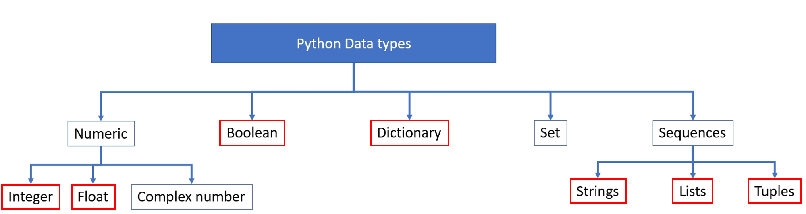

<div class="cell markdown">


<h1><center>Session 1</center></h1>

<h1><center>Variables and data types. Arrays. Structure</center></h1>

**Course creator and speaker:** Manuel David Soto. MSc in Geology,
University of Texas at Austin, USA.

**Organizer:** Ulises Berman. Student of Geophysical Eng, USB, Caracas,
Venezuela. President of the AAPG USB Student Chapter.

<a  id="toc"></a>

<h3>Table of contents</h3>

  - [1 Variables and data types](#variables)
      - [1.1 Introduction](#intro)
      - [1.2 Variables in Python](#variables)
      - [1.3 Data types](#data_types)
          - [1.3.1 Numeric data type](#numeric_data_type)
          - [1.3.2 Boolean data type](#boolean_data_type)
          - [1.3.3 Dictionary](#dictionary)
          - [1.3.4 Sequences](#sequences)
              - [1.3.4.1 Strings](#strings)
              - [1.3.4.2 List](#lists)
              - [1.3.4.3 List of lists](#list_list)
              - [1.3.4.4 Tuples](#tuples)
  - [2 Arrays](#arrays)
      - [2.1 Introduction](#numpy_basics)
      - [2.2 Generating NumPy arrays](#creation1)  
      - [2.3 Accessing the array elements](#numpy_accesing)
      - [2.4 NumPy array attributes](#numpy_attributes)
      - [2.5. Linear algebra](#lineal_algebra)
  - [3 Python structure](#struc)
      - [3.1 Built-in functions](#bif)
      - [3.2 Standard libraries](#sl)  
      - [3.3 External libraries](#el)
      - [3.4 User defined functions](#udf)

</div>

<div class="cell markdown">

<a  id="variables"></a>

<h1> 1 Variables and  data types </h1>

<a  id="intro"></a>

<h2> 1.1 Introduction </h2>

<h4>My first Python program</h4>

</div>

<div class="cell code" data-scrolled="true">

``` python
# My life is simple, I'm just a comment

print('Hello World!')
```

</div>

<div class="cell markdown">

<h4> Python as a calculator   </h4>

</div>

<div class="cell code">

``` python
11 + 666
```

</div>

<div class="cell code" data-scrolled="true">

``` python
10000 * 5
```

</div>

<div class="cell markdown">

Print is a function that allows concatenation of elements of different
type, separated by commas

</div>

<div class="cell code" data-scrolled="true">

``` python
print('This number', 10000 * 123456789, 'is big')
```

</div>

<div class="cell markdown">

<h3> Python Arithmetic Operators    </h3>

The arithmetic operators available in Python are:

| Operator          | Description                                                           | Example  |
| ----------------- | --------------------------------------------------------------------- | -------- |
| \+ Addition       | Add values on either side of the operator                             | 5 + 4    |
| \- Subtraction    | Subtract right operand from left operand                              | 5 - 3    |
| \* Multiplication | Multiplies values on either side of the operator                      | 5 \* 3   |
| / Division        | Divides left hand operand by right hand operand                       | 6 / 2    |
| % Modulus         | Divides left hand operand by right hand operand and returns remainder | 6%3      |
| \*\* Exponent     | Performs exponential (power) calculation on operators                 | 6 \*\* 2 |
| // floor division | Performs the floor division of two operators                          | 9 //4    |

</div>

<div class="cell code">

``` python
#The normal division

9/4
```

</div>

<div class="cell code">

``` python
# Integer part of the division

9//4
```

</div>

<div class="cell code">

``` python
# Remainder of the division

9 % 4
```

</div>

<div class="cell markdown">

<a  id="variables"></a>

<h2> 1.2 Variables in Python </h2>

Variables are reserved memory locations to store values. This means that
when you create a variable you reserve some space in memory.

Based on the data type of a variable, the interpreter allocates memory
and decides what can be stored in the reserved memory. Therefore, by
assigning different data types to variables, you can store integers,
decimals or characters in these variables.

<h4> Rules for variables</h4>

  - A variable name **must** start with a letter or the underscore
    character.  
  - A variable name **cannot** start with a number.  
  - A variable name **can only** contain alpha-numeric characters and
    underscores (A-z, 0-9, and \_ ).  
  - Variable names **are case-sensitive** (python, Python and PYTHON are
    three different variables).

<h4> Assigning values to variables</h4>

The declaration happens automatically when you assign a value to a
variable. The equal sign (=) is used to assign values to variables. The
operand to the left of the = operator is the name of the variable and
the operand to the right of the = operator is the value stored in the
variable.

More about variables at: <https://realpython.com/python-variables/>

</div>

<div class="cell code">

``` python
# Simple calculation

apples = 20
cost = 0.15
currency = 'Euros'
total = cost * apples

print('Total cost of apples:', total, currency)
```

</div>

<div class="cell code">

``` python
# Example Pythagoras calculation

side1 = 20
side2 = 30
unit = 'cm'
side3 = (side1**2 + side2**2)**0.5

print("Side 3 :", side3, unit)
```

</div>

<div class="cell markdown">

<div class="alert alert-block alert-warning">
<font size="6"><p> &#127947;</font> 
    <b>Exercise 1: </b>
    
If the Average velocity to the target is 3000 m/sec and the target depth is 5000 m, calculate the two way time to the target according to the following formula:

\begin{align}
TWT=2*( \frac{Depth}{Velocity})
\end{align}

Define the variables and use the formula to obtain the TWT.

</div>

</div>

<div class="cell markdown">

<h4> Keywords   </h4>

In Python there are some reserved words that cannot be used as a
variable names:

| Keyword  | Description                                                                                           |
| -------- | ----------------------------------------------------------------------------------------------------- |
| and      | A logical operator                                                                                    |
| as       | To create an alias                                                                                    |
| assert   | For debugging                                                                                         |
| break    | To break out of a loop                                                                                |
| class    | To define a class                                                                                     |
| continue | To continue to the next iteration of a loop                                                           |
| def      | To define a function                                                                                  |
| del      | To delete an object                                                                                   |
| elif     | Used in conditional statements, same as else if                                                       |
| else     | Used in conditional statements                                                                        |
| except   | Used with exceptions, what to do when an exception occurs                                             |
| False    | Boolean value, result of comparison operations                                                        |
| finally  | Used with exceptions, a block of code that will be executed no matter if there is an exception or not |
| for      | To create a for loop                                                                                  |
| from     | To import specific parts of a module                                                                  |
| global   | To declare a global variable                                                                          |
| if       | To make a conditional statement                                                                       |
| import   | To import a module                                                                                    |
| in       | To check if a value is present in a list, tuple, etc.                                                 |
| is       | To test if two variables are equal                                                                    |
| lambda   | To create an anonymous function                                                                       |
| None     | Represents a null value                                                                               |
| nonlocal | To declare a non-local variable                                                                       |
| not      | A logical operator                                                                                    |
| or       | A logical operator                                                                                    |
| pass     | A null statement, a statement that will do nothing                                                    |
| raise    | To raise an exception                                                                                 |
| return   | To exit a function and return a value                                                                 |
| True     | Boolean value, result of comparison operations                                                        |
| try      | To make a try...except statement                                                                      |
| while    | To create a while loop                                                                                |
| with     | Used to simplify exception handling                                                                   |
| yield    | To end a function, returns a generator                                                                |

</div>

<div class="cell markdown">

More information on data types at:
<https://docs.python.org/3/library/datatypes.html>

</div>

<div class="cell code">

``` python
```

</div>

<div class="cell markdown">

<a  id="data_types"></a>

<h2> 1.3 Data types </h2>

In Python data types refers to the classification or categorization of
data items. It represents the kind of value that tells what operation
can be performed on a particular data. The following image shows the
main data types available in Python, as well as the more relevant for
log analysis (in red):



</div>

<div class="cell markdown">

The function `type()` tells you the type of data of a variable

</div>

<div class="cell code">

``` python
# What kind of data is the variable the unit in the Pythagoras calculation?

type(unit)
```

</div>

<div class="cell markdown">

<a  id="numeric_data_type"></a>

<h3> 1.3.1 Numeric data type </h3>

In Python, numeric data types represents the data which has a numerical
value

  - **Integer**: The number could be positive or negative, and there is
    not limit to how long an integer value can be.
  - **Float**: It is a real number with floating point representation.
    It is specified by a decimal point.
  - **Complex**: It is a complex number. It is specified as (real part)
    + (imaginary part)i.
  - **None**: It is another special type to denote null object or
    variable

</div>

<div class="cell code">

``` python
# Assignning variables

a = 10
b = 10.0
c = 10.5 + 20.5j

print("Integer:", a)
print("Real or float:", b)
print("Real + complex:", c)
```

</div>

<div class="cell code">

``` python
# Printing the data types

print(type(a))
print(type(b))
print(type(c))
```

</div>

<div class="cell code">

``` python
# The value of e is changing

e = a + b

print(e)
```

</div>

<div class="cell code">

``` python
d = a + c

print(d)
```

</div>

<div class="cell code">

``` python
# None is null object or variable, different of zero

e = None
type(e)
```

</div>

<div class="cell markdown">

<div class="alert alert-block alert-warning">
<font size="6"><p> &#127947;</font> 
    <b>Exercise 2: </b>
    
The relation between velocity and depth is related according to the following formula:

\begin{align}
Velocity (m/sec)=2800 + 0.7 * Depth (m)
\end{align}

* What is the Velocity (m/sec) at 3000 meters?  
* What is the Velocity (m/sec) at 6000 feet?  

The conversion factor from ft to mt is 0.3048

</div>

</div>

<div class="cell markdown">

<a  id="boolean_data_type"></a>

<h3>1.3.2 Boolean data type and operators</h3>

In Python the Boolean variables can have **True** or **False** value.

</div>

<div class="cell code">

``` python
a = True
b = False

print(a)
print(b, '\n')

print("a type :", type(a))
print("b type :", type(b))
```

</div>

<div class="cell markdown">

<h4> Boolean operators </h4>

The Boolean operators available in Python are:

Assume that a = 8 and b = 10

| Operator | Description                                                                                                       | Example                                              |
| -------- | ----------------------------------------------------------------------------------------------------------------- | ---------------------------------------------------- |
| \==      | If the values of two operands are equal, then the condition becomes true.                                         | (a == b) is not true.                                |
| \!=      | If values of two operands are not equal, then condition becomes true.                                             | (a \!= b) is true.                                   |
| \<\>     | If values of two operands are not equal, then condition becomes true.                                             | (a \<\> b) is true. This is similar to \!= operator. |
| \>       | If the value of left operand is greater than the value of right operand, then condition becomes true.             | (a \> b) is not true.                                |
| \<       | If the value of left operand is less than the value of right operand, then condition becomes true.                | (a \< b) is true.                                    |
| \>=      | If the value of left operand is greater than or equal to the value of right operand, then condition becomes true. | (a \>= b) is not true.                               |
| \<=      | If the value of left operand is less than or equal to the value of right operand, then condition becomes true.    | (a \<= b) is true.                                   |

</div>

<div class="cell code">

``` python
a = 10 == 20
print(a)
```

</div>

<div class="cell markdown">

<div class="alert alert-block alert-warning">
<font size="6"><p> &#127947;</font> 
    <b>Exercise 3: </b>
    
* How much time takes a wave to travel through water in 2220 m, V=1500 m/s?
* How much time takes a wave to travel through air  in 500 m, V=340 m/s?
* Write a small piece of code in Python to calculate the travel times and also find which is longer.
    
</div>

</div>

<div class="cell markdown">

<h3>Python Logical Operators    </h3>

The Logical operators available in Python are:

| Operator        | Description                                                          | Example                |
| --------------- | -------------------------------------------------------------------- | ---------------------- |
| and Logical AND | If both the operands are true then condition becomes true.           | (a and b) is true.     |
| or Logical OR   | If any of the two operands are non-zero then condition becomes true. | (a or b) is true.      |
| not Logical NOT | Used to reverse the logical state of its operand.                    | Not(a and b) is false. |

</div>

<div class="cell code">

``` python
b = True and True
print(b)

c = False or False
print(c)

d = not(False)
print(d)
```

</div>

<div class="cell markdown">

<a  id="dictionary"></a>

<h3>1.3.3 Dictionary   </h3>

A dictionary is a collection of unordered, changeable and non indexable
values. It has a general structure that can be summarized as keys-values
pairs, in which both can be strings or numbers, but keys have to be
unique. In Python, dictionaries are written with curly brackets, with
colon (:) as separator between each individual key and value, and comma
(,) as separator between pairs. Dictionaries are good option for
formations tops, mineral compositions, etc.

</div>

<div class="cell code" data-scrolled="true">

``` python
# Example of a dictionary example (key1: value1, key2: value2, ... , keyn: valuen,)

grocery = {2: "fajitas", 1: "chicken", 4: "fish", 3:"coffe", 7:"bread", 0:'milk'}

print(grocery)
```

</div>

<div class="cell code">

``` python
# Values associated with the keys

print(grocery[0])
print(grocery[1])
print(grocery[3])
print(grocery[7])
```

</div>

<div class="cell markdown">

<h4>Some useful Python functions and methods of the list data type</h4>

| Description                           | Python function and methods      |
| ------------------------------------- | -------------------------------- |
| Dictionary length                     | `len(dictionary_variable)`       |
| Adding elements to dictionary         | `dictionary_variable[key]=value` |
| Deleting elements from the dictionary | `del dictionary_variable[key]`   |
| Clear a dictionary                    | `dictionary_variable.clear()`    |

</div>

<div class="cell code">

``` python
# Check these functions

print(len(grocery))

grocery[5] = "olives"

print(grocery)

del grocery[3]

print(grocery)
```

</div>

<div class="cell code">

``` python
grocery.clear()

print(grocery)
```

</div>

<div class="cell code" data-scrolled="true">

``` python
# Example of a dictionary with strings as keys

shale = {'clay': 60, "calcite": 20, "quartz": 15, "micas": 5}
unit = 'weight %'
print(shale)
print('Shale: ', shale['quartz'], unit)
```

</div>

<div class="cell markdown">

<div class="alert alert-block alert-warning">
<font size="6"><p> &#127947;</font> 
    <b>Exercise 4: </b>
    
Write a dictionary with the following composition (weight %) of a granite:
    
    Quartz       25   
    Orthoclase   50   
    Plagioclase  10   
    Micas        10   
    Anphibole     5   
  
Using Python, present the values for orthoclase and micas
</div>

</div>

<div class="cell markdown">

<a  id="sequences"></a>

<h3>1.3.4 Sequences</h3>

Sequences in Python is a succession of values bound together by a
container that has a same type. There are 7 types of sequences in Python
but the more important three are String, Tuples and Lists. Using an
index we can access to the elements of the sequence. In Python the index
start in zero, and a certain element of the sequence can be access with
square brackets. Indexes are numbered from 0 to n-1 where n is the
number of items (or characters), and they are positioned between the
items:

    Sequence:  H  e  l  l  o  ,     w  o  r  l  d  !
    
    Index:     0  1  2  3  4  5  6  7  8  9 10 11 12

The function `len()` gives you the length of the sequence

</div>

<div class="cell code">

``` python
sequence="Hello, World!"

print(sequence[0])
print(sequence[1])
print(sequence[2])
print(sequence[3])
print(sequence[4])
print(sequence[5])
print(sequence[6])
print(sequence[7])
print(sequence[8])
print(sequence[9])
print(sequence[10])
print(sequence[11])
print(sequence[12])

print(sequence[6]) # What character is this?

print("The length of the sequence is:",len(sequence))

print("The type of the sequence is:",type(sequence))
```

</div>

<div class="cell markdown">

<a  id="strings"></a>

<h4>1.3.4.1 Strings   </h4>

A string can be created simply by enclosing characters in quotes. Python
treats single quotes the same as double quotes.

</div>

<div class="cell code">

``` python
# Examples

variable1 = "Salmorejo"
print(variable1)

variable2 = 'Salmón'
print(variable2)

variable3 = 'Sandía'
print(variable3)
```

</div>

<div class="cell code">

``` python
# Everything count in the strings

variable2 == 'Salmon'
```

</div>

<div class="cell markdown">

<h4> Some useful Python function and methods</h4>

| Description                                                | Python fuction or method        |
| ---------------------------------------------------------- | ------------------------------- |
| Concatenating strings                                      | `string1 + string2`             |
| Replacing characters in the string                         | `string1.replace(char1, char2)` |
| <span class="burk">Verify if some characters are in string | `char1 in string1`              |
| Find the possition of a character in a string              | `string1.find(char1)`           |
| Length of a string                                         | `len(string1)`                  |

</div>

<div class="cell code">

``` python
lunch = variable1 + variable2 + variable3
print(lunch,'\n')

lunch = variable1+", "+variable2+", "+variable3
print(lunch)
```

</div>

<div class="cell code">

``` python
lunch = lunch.replace("Sandía", "Café")

print(lunch)
```

</div>

<div class="cell code">

``` python
filename = "program.txt"

filename = filename.replace("txt", "py")

print(filename)
```

</div>

<div class="cell code">

``` python
filename = filename.replace(".", "-v2.")

print(filename)
```

</div>

<div class="cell code">

``` python
# The in commands give you a Boolean variable

country = 'Malaysia'

'lay' in country
```

</div>

<div class="cell code">

``` python
# The find commands give you the index of the string

country.find('lay')
```

</div>

<div class="cell markdown">

<div class="alert alert-block alert-warning">
<font size="6"><p> &#127947;</font> 
    <b>Exercise 5: </b>
    
Write in Python a variable with the following string

"A subsurface body of rock having sufficient porosity and permeability to store and transmit fluids. Metamorphic rocks are the most common reservoir rocks because they have more porosity than most igneous and sedimentary rocks and form under temperature conditions at which hydrocarbons can be preserved. A reservoir is a critical component of a complete petroleum system."
   
    
* Print the variable in the screen   
* Correct the mistakes in the variable using the replace method   
* Verify if temperature is in the string   
* Verify if kritical is in the string   
* What is the string length?   

</div>

</div>

<div class="cell markdown">

<a  id="lists"></a>

<h5>1.3.4.2 Lists   </h5>

A list is sequence of different data types \[strings, floats. integers,
boolean, ...\] inside square brackets and separated by commas.

</div>

<div class="cell code">

``` python
# Example

list1 = ["orange", "banana", 1, 2, True, None]

print(list1)
```

</div>

<div class="cell markdown">

You can access one element of the list using square brackets, but
remember start counting in 0

</div>

<div class="cell code">

``` python
# Example 2nd element

list1[1]
```

</div>

<div class="cell code">

``` python
# 3th and 5th elements

print(list1[2])
print(list1[4])
```

</div>

<div class="cell markdown">

A list could be initialized in different ways

  - Create a empty list: `list1=[]`
  - Create a list with n equal values: `list1=[value]*n`

</div>

<div class="cell code">

``` python
# Empty list

list1 = []
print(list1)

# List of 10 elements

list2 = [30]*10
print(list2)

print(len(list2))
```

</div>

<div class="cell markdown">

To change an element of the list (this method cannot be used with Tuples
or strings)

</div>

<div class="cell code">

``` python
# Changing 4th & 6th elements

list2[3] = 10
list2[5] = 100

print(list2)
```

</div>

<div class="cell markdown">

<h4> Some useful methods and functions of lists data type</h4>

| Function or method                                 | Python Expression  |
| -------------------------------------------------- | ------------------ |
| add an element to a list                           | `list.append(obj)` |
| Maximum of a list                                  | `max(list)`        |
| Minimum of a list                                  | `min(list)`        |
| Returns count of how many times obj occurs in list | `list.count(obj)`  |
| Sort the list                                      | `list.sort()`      |
| Reverse the list                                   | `list.reverse()`   |

</div>

<div class="cell code">

``` python
# Append a value

list2.append(1000)
print(list2)

# Print maximum, minimum and how many times ocurrs an object

print("Maximum value:",max(list2))
print("Minimum value:",min(list2))
print("How many times occurs 30:",list2.count(30))

#Sorting a list

list2.sort()
print(list2)

#Reversing a list

list2.reverse()
print(list2)
```

</div>

<div class="cell code">

``` python
list2
```

</div>

<div class="cell markdown">

<div class="alert alert-block alert-warning">
<font size="6"><p> &#127947;</font> 
    <b>Exercise 7: </b>
    
These are the horizon tops and its depths (m):

    Surface       0  
    Cretaceous 1500   
    Jurassic   2000   
    Triassic   3000   
    Paleozoic  4500   

* Store the list of horizons and its corresponding depths in a list variable  
* Print the lists  
* Print the name and the depth of the third horizon in the list  
* What is the maximum depth?  
* What is the minimum depth?  
* What is the average depth?  
* How many horizons are in the list  
* Verify that the number of horizons names and number of horizons tops are the same
</div>

</div>

<div class="cell markdown">

<a  id="list_list"></a>

<h5>1.3.4.3 Lists of lists   </h5>

A list of list could be interpreted as a matrix in algebra notation, for
example

\[list row 1, list row 2, list row 3, list row 4\]

\[ \[ E11, E12, E13, E14, E15\],  
\[ E21, E22, E23, E24, E25\],  
\[ E31, E32, E33, E34, E35\],  
\[ E41, E42, E43, E44, E45\],  
\[ E51, E52, E53, E54, E55\],  
\[ E61, E62, E63, E64, E65\],  
\[ E71, E72, E73, E74, E75\] \]

</div>

<div class="cell code">

``` python
# Example

a = [[2, 3, 4], [5, 6, 7], [8, 9, 10]]

print(a)
```

</div>

<div class="cell markdown">

Using the following Python expressions allow to access to the list of
list elements:

| Description           | Python expression       |
| --------------------- | ----------------------- |
| A row                 | `variable[row]`         |
| A particular location | `variable[row][column]` |

</div>

<div class="cell code">

``` python
row = 2
column = 1

print(a[row])

print(a[row][column])
```

</div>

<div class="cell markdown">

The differences between lists and tuples are subtle but important. Ones
created lists can be modified, tuples instead are immutable.

</div>

<div class="cell markdown">

<a  id="tuples"></a>

<h4>1.3.4.4 Tuples   </h4>

A tuple is sequence of different Python objects (strings, floats.
integers, boolean, ...) inside parenthesis and separated by commas.

</div>

<div class="cell code">

``` python
# Example

tuple1 = ("Oranges", "Onion", "Lettuce")

tuple2 = ("TT1", 34567, 76543, 23)

print(tuple1)

print(tuple1[0])

print(tuple1[2])

print(tuple2)
```

</div>

<div class="cell markdown">

<div class="alert alert-block alert-warning">
<font size="6"><p> &#127947;</font> 
    <b>Exercise 6: </b>
    
These are the horizon tops and its depths (m):

    Surface       0  
    Cretaceous 1500  
    Jurassic   2000  
    Triassic   3000  
    Paleozoic  4500  

Write one tuple with the horizons name and the corresponding depths. Print the name and the depth of the third horizon.
  
</div>

</div>

<div class="cell code">

``` python
# Demostration

one_list = [1,2,3,4]
one_tuple = (1,2,3,4)

print(one_list)
print(one_tuple)
```

</div>

<div class="cell code">

``` python
# Lets change 3rd in the list

one_list[2] = 5
print(one_list)
```

</div>

<div class="cell code">

``` python
# Lets change 3rd in the tuple

one_tuple[2] = 5
print(one_tuple)
```

</div>

<div class="cell markdown">

<h3>End of part</h3>

[Return to Table of Content](#toc)

</div>

<div class="cell markdown">

<a  id="arrays"></a>

<h1>2 Arrays</h1>

<https://numpy.org>

<a  id="numpy_basics"></a>

<h2>2.1 Introduction</h2>

**NumPy (Numerical Python) is an external package that provides the most
important data type for us (geoscientists, engineers, petrophysicists),
the array (or matrix).** Most of the data we are going to use have this
structure which holds some benefits over the Python lists, such as:

  - Being more compact
  - Faster access in reading and writing items
  - Algebra operations
  - Can be parallelized for GPU processing

</div>

<div class="cell markdown">

To use NumPy, first, you need to install the module using the pip
command in the Command Prompt (Python introduction)

`pip install numpy`

Inside the Jupyter notebook or script, import the module with:

`import numpy as np`

Been np an alias to facilitate the writing of the numpy functions

</div>

<div class="cell code">

``` python
import numpy as np
```

</div>

<div class="cell markdown">

<a  id="creation1"></a>

<h2>2.2 Generating NumPy arrays</h2>

There are different ways to create arrays (vectors and matrices), some
of the most important are:

  - Converting a list or list of lists to an array with the function
    `np.array()`
  - Creating **1D array (vector) or 2D array (matrix)** of zeros with
    the function `np.zeros()`
  - Creating 1D array or 2D array of fix value with the function
    `np.full()`
  - Creating 1D array or 2D array of random values (floats) with the
    function `np.random.rand()`
  - Creating 1D array or 2D array of random values (integer) with the
    function `np.random.randint()`

Let's review them

</div>

<div class="cell code">

``` python
# Converting list to vector or 1d array

list0 = [10, 1, 20, 3]    # lists have commas, arrays not

vector = np.array(list0)

print("List:", list0)
print(type(list0), '\n')

print("Vector:", vector)
print(type(vector))
```

</div>

<div class="cell code">

``` python
# Converting lists of list to matrix or 2d array

list_list = [[2.0, 3, 4], [5, 6, 7], [8, 9, 10]]

matrix = np.array(list_list)

print("List of lists:", list_list,'\n')
print("Matrix:\n", '\n', matrix)
print(type(matrix))
```

</div>

<div class="cell code">

``` python
# Creating a vector of zeros

vector = np.zeros(10)

print("Vector of zeros:", vector)
```

</div>

<div class="cell code">

``` python
# Creating a matriz of zeros

matrix = np.zeros((5, 5))

print("Array of zeros:\n", '\n', matrix)
```

</div>

<div class="cell code">

``` python
# Creating a vector with a constant value

vector8 = np.full((5), 8)

print("Vector with constant value:\n", '\n',vector8)
```

</div>

<div class="cell code">

``` python
# Creating a matrix with a constant value

matrix9 = np.full((5, 8), 9)

print("Array with constant value:\n", '\n',matrix9)
```

</div>

<div class="cell code" data-scrolled="false">

``` python
# Generating an array with float random values (0 to 1)

array_random = np.random.rand(1,5)

# You can use also np.random.rand(5) but there is a small difference

print("Array with random values:", array_random)

array_random.shape
```

</div>

<div class="cell code" data-scrolled="false">

``` python
# Generating a matrix with float random values (0 to 1)

matrix_random = np.random.rand(7,5)

print("Matrix with random values:\n", '\n', matrix_random)
```

</div>

<div class="cell code">

``` python
# Generating a vector with random integers (0 to 100)

print("Vector with random integers: \n", '\n', np.random.randint(100, size=(5)))
```

</div>

<div class="cell code">

``` python
# Generating a vector with random integers (20 to 80)

print("Vector with random integers: \n", '\n', np.random.randint(20, 80, size=(5,5)))
```

</div>

<div class="cell code">

``` python
# Generating a matrix with inteder random values (0 to 100)

print("Matrix with random integers: \n", '\n', np.random.randint(100, size=(5,5)))
```

</div>

<div class="cell markdown">

<div class="alert alert-block alert-warning">
<font size="6"><p> &#127947;</font> 
    <b>Exercise 8: </b>
    
Create a matrix (list of lists) with the following values:


    | 6   8  12  24  33|  
    |11   4  12   6  67|  
    |23   9  67  10  43|  
    | 1  12  34  18   2|   
    | 7  11   2  23  78|   
    | 8  24   1   5  23|  

* Print the matrix  
* Print the row 3  
* Calculate the dimensions of the matrix  
* Print the element [3,4]  
* What is the minimum of the line 3  
* What is the maximum of the line 2  

</div>

</div>

<div class="cell markdown">

<a  id="numpy_accesing"></a>

<h2>2.3 Accessing the array elements</h2>

The i-th value (counting from zero) can be accessed by specifying the
desired index in square brackets, just as with Python lists:

</div>

<div class="cell code">

``` python
# Printing the 3rd element of a vector

wavelet=np.array([10,1,20,3])

print(wavelet[2])
```

</div>

<div class="cell markdown">

Using the following Python expressions allow to access to the elements
of a a 2D array :

| Description           | Python expression       |
| --------------------- | ----------------------- |
| A row                 | `variable[row]`         |
| A column              | `variable[:,column]`    |
| A particular location | `variable[row, column]` |

</div>

<div class="cell code">

``` python
matrix = np.random.rand(6,6)

print(matrix)
```

</div>

<div class="cell code">

``` python
# Printing 3th row

print(matrix[2])
```

</div>

<div class="cell code">

``` python
# Printing 5th column

print(matrix[:,4])
```

</div>

<div class="cell code">

``` python
# Printing a specific element

print(matrix[2, 4])
```

</div>

<div class="cell markdown">

<a  id="numpy_attributes"></a>

<h2>2.4 Numpy array attributes</h2>

These are the main attributes of a NumPy array:

| Description                       | Attribute         |
| --------------------------------- | ----------------- |
| dimensions of the array (1 or 2D) | `variable.ndim`   |
| Size of each dimension            | `variable.shape`  |
| Array Size                        | `variable.size`   |
| Array type                        | `variable.dtype`  |
| Array total size in bytes         | `variable.nbytes` |

</div>

<div class="cell code">

``` python
print("Number of dimensions :",matrix.ndim)
print("Shape of the array :",matrix.shape)
print("Array size:",matrix.size)
print("Array type:",matrix.dtype)
print("Element size in bytes:",matrix.itemsize)
print("Array total size in bytes:",matrix.nbytes)
```

</div>

<div class="cell markdown">

<div class="alert alert-block alert-warning">
<font size="6"><p> &#127947;</font> 
    <b>Exercise 9: </b>
    
* Generate a 5x5 matrix of constant value equal to 10  
* Generate a random 6x6 matrix
* Print the values of the third column of both arrays    
* Print the attributes of both matrices    
* Generate a 3 million elements array and calculate all its attributes    

</div>

</div>

<div class="cell markdown">

<a  id="lineal_algebra"></a>

<h2>2.5 Linear algebra</h2>

One of disadvantages of a Python list is that we need to iterate on each
element of the list to perform mathematical operations, while you can do
operation between arrays, even linear algebra, with a very simple
notation:

Basic concepts on linear algebra at:

<https://towardsdatascience.com/linear-algebra-for-deep-learning-f21d7e7d7f23>

<https://www.khanacademy.org/math/linear-algebra>

</div>

<div class="cell code">

``` python
# Define a matrix

matrix = np.array([[2.0, 7, 4], [5, 6, 9], [1, 9, 10]])

print("Matrix:\n", '\n', matrix)
```

</div>

<div class="cell code">

``` python
# Multiply by a constant

matrix10 = matrix*10

print("\nResult of the multiplication by an integer:\n", '\n', matrix10)
```

</div>

<div class="cell code">

``` python
# Sum of matrixes

matrix2 = matrix + matrix10

print("\nSum of matrices:\n", matrix2)
```

</div>

<div class="cell code">

``` python
# Multiply a matrix by a vector

vector = np.array([10, 23, 45])

result1 = matrix10 * vector

print("Multiply a matrix by a vector\n", '\n', result1)
```

</div>

<div class="cell code">

``` python
# Dot product of two Nump arrays

a = np.array([[1, 2], [3, 4]])
b = np.array([[11, 12], [13, 14]])

print('a:\n',a,'\n')
print('b:\n',b,'\n')

print("Dot product:\n", np.dot(a, b))
```

</div>

<div class="cell code" data-scrolled="true">

``` python
# Power of a matrix

print("Matrix result1 raised to power 5:\n", '\n', np.linalg.matrix_power(matrix, 5))

# This is not powering each element of the matrix
```

</div>

<div class="cell code">

``` python
# Determinant of a matrix

print("Determinant of matrix\n", '\n', np.linalg.det(matrix))
```

</div>

<div class="cell code">

``` python
# Inverse of a matrix

print("\nInverse of matrix:\n", np.linalg.inv(matrix))
```

</div>

<div class="cell markdown">

<div class="alert alert-block alert-warning">
<font size="6"><p> &#127947;</font> 
    <b>Exercise 10: </b>
    
Generate two 5x5 matrices, one with constant value equal to 10, and the other with random values

* Determine if the matrices are singular (Determinant=0)    
* Calculate the inverse of the matrices    
* Sum both matrices    
* Convert the constant matrix to zero matrix    

</div>

</div>

<div class="cell markdown">

<div class="alert alert-block alert-warning">
<font size="6"><p> &#127947;</font> 
    <b>Exercise 11: </b>
    
    
Solve the following Linear equations system:

\begin{align}
1x+3y-2z = 5  \\
3x+5y+6z = 7  \\
2x+4y+3z = 8  
\end{align}

The linear system can be represented in linear algebra as:

\begin{align}
A \cdot x=b
\end{align}


The solution will be:

\begin{align}
x=A^{-1} \cdot b
\end{align}


</div>

</div>

<div class="cell markdown">

<h3>End of part</h3>

[Return to Table of Content](#toc)

</div>

<div class="cell markdown">

<a  id="struc"></a>

<h1>3 Python structure</h1>

Functions are the building block of Python. They are executed when they
are call, receiving parameters and then produce a result or perform a
tasks. As a concept it is the same as a mathematic function:

\\begin{align}  {P}=f(x,y) \\end{align}

Been x,y the **arguments** (if there is any) and P the **result** (if
there is any). The functions in Python can be integrated or built in the
core of the program, group in standard libraries (included in Python but
inactive) or in public packages (built outside of Python), or even
defined by the user:


Let's see examples of these four components of Python:

</div>

<div class="cell markdown">

<a  id="bif"></a>

<h2> 3.1 Built-in functions</h2>

The Python interpreter has a number of **built-in functions (BIF, the
skull) and types that are always available.** They are listed here in
alphabetical order.

| Function        | Description                                                                                   |
| --------------- | --------------------------------------------------------------------------------------------- |
| abs()           | Returns the absolute value of a number                                                        |
| all()           | Returns True if all items in an iterable object are true                                      |
| any()           | Returns True if any item in an iterable object is true                                        |
| ascii()         | Returns a readable version of an object. Replaces none-ascii characters with escape character |
| bin()           | Returns the binary version of a number                                                        |
| bool()          | Returns the boolean value of the specified object                                             |
| bytearray()     | Returns an array of bytes                                                                     |
| bytes()         | Returns a bytes object                                                                        |
| callable()      | "Returns True if the specified object is callable, otherwise False"                           |
| chr()           | Returns a character from the specified Unicode code.                                          |
| classmethod()   | Converts a method into a class method                                                         |
| compile()       | "Returns the specified source as an object, ready to be executed"                             |
| complex()       | Returns a complex number                                                                      |
| delattr()       | Deletes the specified attribute (property or method) from the specified object                |
| dict()          | Returns a dictionary (Array)                                                                  |
| dir()           | Returns a list of the specified object's properties and methods                               |
| divmod()        | Returns the quotient and the remainder when argument1 is divided by argument2                 |
| enumerate()     | Takes a collection (e.g. a tuple) and returns it as an enumerate object                       |
| eval()          | Evaluates and executes an expression                                                          |
| exec()          | Executes the specified code (or object)                                                       |
| filter()        | Use a filter function to exclude items in an iterable object                                  |
| float()         | Returns a floating point number                                                               |
| format()        | Formats a specified value                                                                     |
| frozenset()     | Returns a frozenset object                                                                    |
| getattr()       | Returns the value of the specified attribute (property or method)                             |
| globals()       | Returns the current global symbol table as a dictionary                                       |
| hasattr()       | Returns True if the specified object has the specified attribute (property/method)            |
| hash()          | Returns the hash value of a specified object                                                  |
| help()          | Executes the built-in help system                                                             |
| hex()           | Converts a number into a hexadecimal value                                                    |
| id()            | Returns the id of an object                                                                   |
| input()         | Allowing user input                                                                           |
| int()           | Returns an integer number                                                                     |
| isinstance()    | Returns True if a specified object is an instance of a specified object                       |
| issubclass()    | Returns True if a specified class is a subclass of a specified object                         |
| iter()          | Returns an iterator object                                                                    |
| len()           | Returns the length of an object                                                               |
| list()          | Returns a list                                                                                |
| locals()        | Returns an updated dictionary of the current local symbol table                               |
| map()           | Returns the specified iterator with the specified function applied to each item               |
| max()           | Returns the largest item in an iterable                                                       |
| memoryview()    | Returns a memory view object                                                                  |
| min()           | Returns the smallest item in an iterable                                                      |
| next()          | Returns the next item in an iterable                                                          |
| object()        | Returns a new object                                                                          |
| oct()           | Converts a number into an octal                                                               |
| open()          | Opens a file and returns a file object                                                        |
| ord()           | Convert an integer representing the Unicode of the specified character                        |
| pow()           | Returns the value of x to the power of y                                                      |
| print()         | Prints to the standard output device                                                          |
| property()      | "Gets, sets, deletes a property"                                                              |
| range()         | "Returns a sequence of numbers, starting from 0 and increments by 1 (by default)"             |
| repr()          | Returns a readable version of an object                                                       |
| reversed()      | Returns a reversed iterator                                                                   |
| round()         | Rounds a numbers                                                                              |
| set()           | Returns a new set object                                                                      |
| setattr()       | Sets an attribute (property/method) of an object                                              |
| slice()         | Returns a slice object                                                                        |
| sorted()        | Returns a sorted list                                                                         |
| @staticmethod() | Converts a method into a static method                                                        |
| str()           | Returns a string object                                                                       |
| sum()           | Sums the items of an iterator                                                                 |
| super()         | Returns an object that represents the parent class                                            |
| tuple()         | Returns a tuple                                                                               |
| type()          | Returns the type of an object                                                                 |
| vars()          | Returns the *dict* property of an object                                                      |
| zip()           | "Returns an iterator, from two or more iterators"                                             |

A complete description of the built-in functions can be found in the
following link: <https://docs.python.org/3/library/functions.html>

</div>

<div class="cell markdown">

<h4>Some mathematical BIF</h4>

</div>

<div class="cell code">

``` python
# Absolute value, minimum, maximum, ...

list_numbers = [10, 20, 15, 2, 70, 12, 22]

print("Absolute value:", abs(-20))
print("Minimum value :", min(list_numbers))
print("Maximum value :", max(list_numbers))
print("Sorted list   :", sorted(list_numbers))
print("Round a number to 4th decimals :", round(23.456789, 4))
print("Round a number to 2nd decimals :", round(23.456789, 2))
print("Round a number with no decimals :", round(23.456789, 0))
print("Sum of a list of numbers :", sum(list_numbers))
```

</div>

<div class="cell markdown">

<div class="alert alert-block alert-warning">
<font size="6"><p> &#127947;</font> 
    <b>Exercise 12: </b>
    
* Create a NumPy array with some random values
* Calculate the maximum and the minimum of the array
* Calculate the Average of the terms
* Print the numbers rounded to 6 decimals

</div>

</div>

<div class="cell markdown">

<h4>Conversion BIF</h4>

The most useful functions to convert data types between float, integer
and string

</div>

<div class="cell code">

``` python
# Conversion from string to float

print(float("10.4"))
print(float(10))

# Conversion from string to integer

print(int("10"))
print(int(10.2))
# print(int("10.2"))
print(int(float("10.2")))
```

</div>

<div class="cell code">

``` python
# Conversion of number to string, very important for file writing

p = 12.567890
q = str(p)

print('q =', q)
print(type(q),'\n')

r = str(round(p, 2))
print('r =', r)
print(type(r),'\n')
```

</div>

<div class="cell markdown">

<div class="alert alert-block alert-warning">
<font size="6"><p> &#127947;</font> 
    <b>Exercise 13: </b>
    
Practice with a couple of examples on how to convert between float, int and str 

</div>

</div>

<div class="cell markdown">

<H4>Input BIF</H4>

The `input()` function allows interactive user input from the keyboard
and convert it into a string.

</div>

<div class="cell code">

``` python
# input function

# datetime is a Python standard library so is included in the installation but needs to be imported

from datetime import datetime

temp = input("Please enter the temperature in ºC of your city: ")    # Remember, temp contains an string

dt = datetime.now()

print()
print('The temperature in Madrid is', temp, 'ºC')    
print('The local time: ', str(dt.hour)+':'+str(dt.minute))
print('Date: ', str(dt.day)+'/'+str(dt.month)+'/'+str(dt.year))
```

</div>

<div class="cell code">

``` python
# Try to do execute this

new_temp = temp + 5
```

</div>

<div class="cell markdown">

<div class="alert alert-block alert-warning">
<font size="6"><p> &#127947;</font> 
    <b>Exercise 14: </b>
    
In a cell write a small program for temperature conversion between Celsius to Fahrenheit with user interactive input

</div>

</div>

<div class="cell markdown">

<h4>Range BIF</h4>

The `range()` function returns a sequence of numbers, starting from 0 by
default, and increments by 1 (by default), and ends at a specified
number. The syntax is the following:

`range(start, stop, step)`

| Parameter | Description                                                                     |
| --------- | ------------------------------------------------------------------------------- |
| start     | Optional. An integer number specifying at which position to start. Default is 0 |
| stop      | Required. An integer number specifying at which position to end.                |
| step      | Optional. An integer number specifying the incrementation. Default is 1         |

Some examples:

</div>

<div class="cell code">

``` python
x = range(13)

print("Example 1:", x)
print("Example 1:", list(x))
type(x)
```

</div>

<div class="cell code">

``` python
x = range(0, 13)

print("Example 2:", list(x))
```

</div>

<div class="cell code">

``` python
x = range(1, 13)

print("Example 3:", list(x))
```

</div>

<div class="cell code">

``` python
x = range(1, 13, 2)

print("Example 4:", list(x))
```

</div>

<div class="cell markdown">

<div class="alert alert-block alert-warning">
<font size="6"><p> &#127947;</font> 
    <b>Exercise 15: </b> Generate a range between 1 and 3000000

* Calculate the average
* Calculate the minimum
* Calculate the maximum

</div>

</div>

<div class="cell markdown">

<a  id="sl"></a>

<h2> 3.2 Standard libraries functions</h2>

**There are hundreds of Standard Libraries (SL, the bones) with their
respective functions.** They are developed by the Python Foundation, and
are already available in Python (included in the installation), however
they need to be imported before use them:

<https://docs.python.org/3/library/>

Some important Standard libraries for us are:

  - random
  - math (see below)
  - statistics

</div>

<div class="cell markdown">

#### Math SL </h2>

In addition to the few Math BIF there is a Math SL that contains more
complex mathematical functions:

| Function         | Description                                         |
| ---------------- | --------------------------------------------------- |
| ceil(x)          | Returns the smallest integer greater than or equal  |
| copysign(x, y)   | Returns x with the sign of y                        |
| fabs(x)          | Returns the absolute value of x                     |
| factorial(x)     | Returns the factorial of x                          |
| floor(x)         | Returns the largest integer less than or equal to x |
| fmod(x, y)       | Returns the remainder when x is divided by y        |
| frexp(x)         | Returns the mantissa and exponent of x as the pair  |
| fsum(iterable)   | Returns an accurate floating point sum of values in |
| isfinite(x)      | Returns True if x is neither an infinity nor a NaN  |
| isinf(x)         | Returns True if x is a positive or negative infinit |
| isnan(x)         | Returns True if x is a NaN                          |
| ldexp(x, i)      | Returns x \* (2\*\*i)                               |
| modf(x)          | Returns the fractional and integer parts of x       |
| trunc(x)         | Returns the truncated integer value of x            |
| exp(x)           | Returns e\*\*x                                      |
| expm1(x)         | Returns e\*\*x - 1                                  |
| log(x\[, base\]) | Returns the logarithm of x to the base (defaults to |
| log1p(x)         | Returns the natural logarithm of 1+x                |
| log2(x)          | Returns the base-2 logarithm of x                   |
| log10(x)         | Returns the base-10 logarithm of x                  |
| pow(x, y)        | Returns x raised to the power y                     |
| sqrt(x)          | Returns the square root of x                        |
| acos(x)          | Returns the arc cosine of x                         |
| asin(x)          | Returns the arc sine of x                           |
| atan(x)          | Returns the arc tangent of x                        |
| atan2(y, x)      | Returns atan(y / x)                                 |
| cos(x)           | Returns the cosine of x                             |
| hypot(x, y)      | Returns the Euclidean norm, sqrt(x*x + y*y)         |
| sin(x)           | Returns the sine of x                               |
| tan(x)           | Returns the tangent of x                            |
| degrees(x)       | Converts angle x from radians to degrees            |
| radians(x)       | Converts angle x from degrees to radians            |
| acosh(x)         | Returns the inverse hyperbolic cosine of x          |
| asinh(x)         | Returns the inverse hyperbolic sine of x            |
| atanh(x)         | Returns the inverse hyperbolic tangent of x         |
| cosh(x)          | Returns the hyperbolic cosine of x                  |
| sinh(x)          | Returns the hyperbolic cosine of x                  |
| tanh(x)          | Returns the hyperbolic tangent of x                 |
| erf(x)           | Returns the error function at x                     |
| erfc(x)          | Returns the complementary error function at x       |
| gamma(x)         | Returns the Gamma function at x                     |
| lgamma(x)        | Returns the natural logarithm of the absolute value |
| pi               | Mathematical constant, the ratio of circumference o |
| e                | mathematical constant e (2.71828...)                |

More information on Math go to:
<https://docs.python.org/3/library/math.html>

</div>

<div class="cell code">

``` python
# Math is alredy included in the Python instalation so the pip isntall is not necessary, just the import

import math
```

</div>

<div class="cell code">

``` python
print(math.pi)

angle_degree = 45

print(math.sin(angle_degree/180*math.pi))    # The argument are radians

side1 = 10
side2 = 20

side3 = math.sqrt(side1**2+side2**2)
print("Side 3:", side3)
```

</div>

<div class="cell markdown">

<div class="alert alert-block alert-warning">
<font size="6"><p> &#127947;</font> 
    <b>Exercise 12: </b>
    
Generate a list of angles from 0 to 359 degrees with step of 2 degrees. Using a for loop calculate cosine of each angle. Try to do a plot.
</div>

</div>

<div class="cell markdown">

<a  id="el"></a>

<h2> 3.3 External libraries</h2>

There are hundred of thousands of **External Libraries (EL, the muscles)
or packages** with their respective function. They are developed by
different individuals, companies, or institutions so they are not
included in the Python installation, they need to be installed (via pip)
and then imported before use them:

<https://pypi.org/>

Some important EL (all with their oun website) for us are:

  - Numpy (numerical operation, see below)
  - Matplotlib (plotting)
  - Pandas (spreadsheet operations)
  - Scipy (mathematics, science, and engineering)
  - Pillow (image manipulation)
  - Lasio (Read and write LAS)
  - Welly (load and present LAS)

Examples of both groups are shown below:

</div>

<div class="cell markdown">

<h4>Numpy EL</h4>

</div>

<div class="cell code">

``` python
# As EL, Numpy need to be installed and then imported before been used

import numpy as np

print(np.pi)

round(np.pi, 5)
```

</div>

<div class="cell markdown">

The Numpy `np.arange()` function returns a sequence of numbers, starting
from 0 by default, and increments by 1 (by default), and ends at a
specified number. The syntax is the following:

`NumPy.arange(start, stop, step)`

| Parameter | Description                                                            |
| --------- | ---------------------------------------------------------------------- |
| start     | Optional. A number specifying at which position to start. Default is 0 |
| stop      | Required. A number specifying at which position to end.                |
| step      | Optional. A number specifying the incrementation. Default is 1         |

Contrary to the `range()`, here the step can be a fraction. Some
examples:

</div>

<div class="cell code">

``` python
x = np.arange(13)

print("Example 1:", x)

type(x)
```

</div>

<div class="cell code">

``` python
x = np.arange(1, 13)

print("Example 2:", x)
```

</div>

<div class="cell code">

``` python
x = np.arange(1, 13, 2)

print("Example 3:", x)
```

</div>

<div class="cell code">

``` python
x = np.arange(0, 1, 0.1)

print("Example 4:", x)
```

</div>

<div class="cell markdown">

<a  id="udf"></a>

<h2> 3.4 User defined function </h2>

A **User Defined Function (UDF)** is a piece of code defined by the
user. This type of functions are important for the following reasons:

  - User-defined functions help to decompose a large program into small
    segments which makes program easy to understand, maintain and debug.
  - If repeated code occurs in a program. Function can be used to
    include those codes and execute when needed by calling that
    function.
  - Programmers working on large project can divide the workload by
    making different functions.

The syntax of the user defined function is:

``` 
def function_name(arguments):
    code
    code
    ....
    return values
    
```

In the UDF the colon (:) and indentation (a tab or four spaces) are
critical because define what is defined inside the function. Only the
return value or variable are know by the rest of the program. Here is an
example of UDF:

</div>

<div class="cell code">

``` python
# Example of a function returnning one value

def conversion_C_F(temp_c):
    temp_f = temp_c * 9/5 + 32
    return temp_f
```

</div>

<div class="cell code">

``` python
f = conversion_C_F(-2)

print('Temperature: ', f, 'ºF')
```

</div>

<div class="cell markdown">

<div class="alert alert-block alert-warning">
<font size="6"><p> &#127947;</font> 
    <b>Exercise 16: </b> Create a function to convert from Fahrenheit to Celsius

</div>

</div>

<div class="cell code">

``` python
# Example of a function with multiple arguments and returnning one value

def line_equation(a, b, x):
    y = a * x + b
    return y
```

</div>

<div class="cell code">

``` python
# Example of a function with multiple arguments and returnning one multiple values

def equations(a, b, x):
    y1 = a * x + b
    y2 = a * x
    return y1, y2
```

</div>

<div class="cell code">

``` python
y = line_equation(10, 34, 10)

print(y)
print(line_equation(10, 34, 100))
```

</div>

<div class="cell code">

``` python
# The name of the ouput variables are not related with the internal variables of the UDF

yy1, yy2 = equations(10, 34, 100)

print(yy1, yy2)
print(equations(100, 340, 1000))
```

</div>

<div class="cell markdown">

<div class="alert alert-block alert-warning">
<font size="6"><p> &#127947;</font> 
    <b>Exercise 17: </b> Create a function to calculate and return the following values of a list:
    
* Average
* Minimum
* Maximum
</div>

</div>

<div class="cell markdown">

<h3>End of part</h3>

[Return to Table of Content](#toc)

</div>
