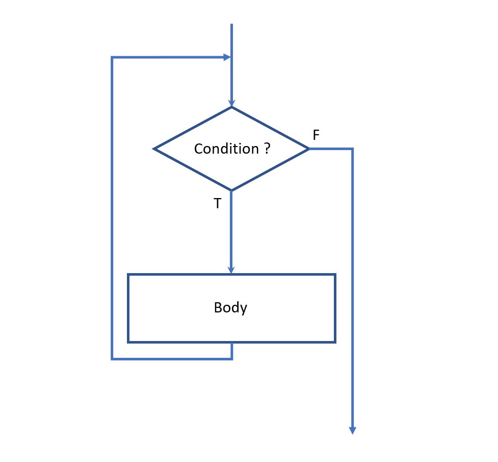

<div class="cell markdown">


<h1><center>Session 2</center></h1>

<h1><center>Flow control. R&W text files. Plots and multi plots. Basic statistics</center></h1>

**Course creator and speaker:** Manuel David Soto. MSc in Geology,
University of Texas at Austin, USA.

**Organizer:** Ulises Berman. Student of Geophysical Eng, USB, Caracas,
Venezuela. President of the USB AAPG Student Chapter.

<a  id="toc"></a>

<h1>Table of contents</h1>

  - [1. Flow control](#flow)
      - [1.1 Conditionals](#if)
      - [1.2 Loops](#loops)
          - [1.2.1 For-loops](#f_loops)
          - [1.2.2 While loops](#w_loops)
  - [2. Read and write text files](#rwt)
      - [2.1 Reading text files](#rtext)
          - [2.1.1 Reading single column text files](#rsingle)
          - [2.1.2 Reading multi column text files with missing
            values](#rmulti)
      - [2.2 Writing text files](#wtext)
          - [2.2.1 Writing simple text reports](#wreport)
          - [2.2.2 Writing single or multi column text files](#wcolumn)
  - [3 Plots](#plots)
      - [3.1 Single plots](#splots)
          - [3.1.1 Point-line plots](#line)
          - [3.1.2 Scatter plots](#scat)
          - [3.1.3 Bar and pie plots](#bar)
      - [3.2 - Multiplots](#mplot)
  - [4 Basic statistics](#stat)
      - [4.1 Univariate analysis](#uni)
          - [4.1.1 Frequency distribution](#freq)
          - [4.1.2 Central tendency](#central)
          - [4.1.3 Dispersion](#disp)
          - [4.1.4 Statistical parameters on your plots](#par)
      - [4.2 Normal distribution and outliers](#normal)
      - [4.3 Normalization](#zscore)
      - [4.4 Bivariate analysis](#bi)
          - [4.4.1 Plots for exploring correlation](#explo)
          - [4.4.2 Covariance and correlation coefficient](#cc)
  - [Annex of formulas](#annex)

</div>

<div class="cell markdown">

<a  id="flow"></a>

<h1>1 Flow control </h1>

Flow control is understood to be the structures or features that control
(if, for, while) the execution and development of a program based on the
fulfillment of certain conditions.

</div>

<div class="cell markdown">

<a  id="if"></a>

<h2>1.1 Conditionals    </h2>

Conditional statements are basic features of any programming language.
**They perform different calculations or actions** depending on whether
a programmer-specified boolean condition evaluates to true or false.


Image from:
<https://en.wikipedia.org/wiki/Conditional_(computer_programming)>

The syntax of the conditional is:

    if (condition to evaluate):
        then do these things only for ‘True’
    else:
        do these other things only for ‘False’.

Here are some examples on conditionals statements:

</div>

<div class="cell code">

``` python
var1 = 200

if var1 == 200:
    print("The value of the variable is 200")
```

</div>

<div class="cell code">

``` python
a = 2
b = 2

if a == b:
    print("a is equal to b")
else:
    print("a is different to b")
```

</div>

<div class="cell code">

``` python
hour = "1pm"
money = 11

if (hour == "1pm") and (money > 10):  
    print("Let´s go to have lunch")
else:
    print("Keep working!")
```

</div>

<div class="cell code">

``` python
hour = 13.1
money = 10

if (hour > 13 and hour < 14):
    if money < 9:
        print("Let´s go to the ATM")
    print("Go to the restaurant")
else:
    print("Keep working")
```

</div>

<div class="cell markdown">

<div class="alert alert-block alert-warning">
<font size="6"><p> &#127947;</font> 
    <b>Exercise 1: </b> 
    
Using if, write an small program with a function that allow to convert between the two temperature scales. The program have to do the following:

- Enter the temperature scale of the input data
- Enter the temperature value
- Print the equivalent temperature in the other scale.

</div>

</div>

<div class="cell markdown">

<a  id="loops"></a>

<h2>1.2 Loops    </h2>

In computer programming, a loop is a sequence of instruction s that is
continually **repeated until a certain condition is reached.**
Typically, a certain process is done, such as getting an item of data
and changing it, and then some condition is checked such as whether a
counter has reached a prescribed number.

The following image is a flow diagram of the loop:



An iteration is one step or cycle of the loop. And there are two types
of loops

  - For loop
  - While loop

More information on loops at:
<https://www.geeksforgeeks.org/loops-in-python/>

</div>

<div class="cell markdown">

<a  id="f_loops"></a>

<h3>1.2.1 For-loops    </h3>

For-loops are typically used when the **number of iterations is known**
before entering the loop. The Python syntax for a for-loop is:

    for (condition):
        Line code 1
        Line code 2
        Line code 3
        .
        .
        .

The indent of the lines after the `for` statement define the code to be
repeated, the indent could be tabs or spaces, but they should not be
mixed. It is recommended four spaces

Here are some example of for-loops:

</div>

<div class="cell code">

``` python
# Example 1

for i in range(11):
    print("Value :", i)
```

</div>

<div class="cell code">

``` python
# Example 2

for i in range(1, 11, 2):
    print("Value :", i)
```

</div>

<div class="cell code">

``` python
# Example 3

var1 = [1, 3, 5, 7, 9]

for var in var1:
    print("Value :", var)
```

</div>

<div class="cell code">

``` python
# Example 4

for i in range(0, len(var1)):
    print("Value :", var1[i])
```

</div>

<div class="cell markdown">

<div class="alert alert-block alert-warning">
<font size="6"><p> &#127947;</font> 
    <b>Exercise 2: </b> Using for loops 

* Print out the numbers 0,1,2,3,4
* Print out 3,4,5
* Print out 3,5,7
* Print each element of the array: colors = ["red", "green", "blue", "purple"]
* Create a new list with the values types of each element changed from str to float numbers=["1","6","5","2","8","9"]
* Calculate the minimum, maximum and average with the function created in the exercise 8.

</div>

</div>

<div class="cell markdown">

<a  id="w_loops"></a>

<h3>1.2.2 While loops</h3>

While-loops are used when the loop needs to be **done until certain
condition is true**. The Python syntax for a while loop is:

    while (condition):
        Line code 1
        Line code 2
        Line code 3
        .
        .
        .

The indentation of the lines after the while statement define the code
to be repeated. Here are some examples of while-loops:

</div>

<div class="cell code">

``` python
# Example 1

i = 0
while (i < 11):
    print("Value :", i)
    i = i+1
```

</div>

<div class="cell code">

``` python
# Example 2

i = 1
while (i < 11):
    print("Value :", i)
    i = i+2
    print("Value :", i)
```

</div>

<div class="cell code">

``` python
# Example 3

var1 = [1, 3, 7, 9, 11]

i = 0
while (i < len(var1)):
    print("Value :", var1[i])
    i = i+1
```

</div>

<div class="cell markdown">

<div class="alert alert-block alert-warning">
<font size="6"><p> &#127947;</font> 
    <b>Exercise 3: </b> Using while loops:

* Print out the numbers 0,1,2,3,4
* Print out 3,4,5
* Print out 3,5,7
* Print each element of the list: colors = ["red", "green", "blue", "purple"]
* Create a new list with the values types of each element changed from str to float numbers=["1","6","5","2","8","9"]
* Calculate the minimum, maximum and average with the function created in the exercise 8.
    
</div>

</div>

<div class="cell markdown">

<div class="alert alert-block alert-warning">
<font size="6"><p> &#127947;</font> 
    <b>Exercise 4: </b> 

    
Create a program to generate the terms of the Fibonacci sequence. Use whatever flow control structure you consider necessary and try to do a simple plot (check the Py examples in session 1). Less is more in this exercise.
    
Reference on the Fibonacci sequence: https://en.wikipedia.org/wiki/Fibonacci_number

</div>

</div>

<div class="cell markdown">

<h2>End of part </h2>

[Return to Table of Content](#toc)

</div>

<div class="cell markdown">

<a  id="rwt"></a>

<h1>2 Read and write text files</h1>

In petrophysics we always have the necessity of reading and writing
files which contain information that we want to process or delivery.
Some common format (from simpler to complex) to us are:

  - Text (columnar data separated by space , commas...)
  - LAS (just a pre organized text files recognized by certain programs)
  - Excel files (mainly arrange by columns)
  - Image files (bmp, jpg, tiff,...)
  - PDF (with text, images and/or tables)
  - ...

As is common in Python, there are different ways to input or output
information, depending on the format of the files and on the library or
packages you use. In this and the following session we are going to
explore simple ways to get information (text files) in and out of
Python. LAS input and output will be cover in section 3.

</div>

<div class="cell markdown">

**Text files are the most simple and important files format used in any
computer (regardless of the operative system)** to save information in a
format familiar to us. Some specific use of the text files are:

  - Simple document like notes or letters
  - Data in columnar shape
  - Keepers of parameters or environment variables for programs or
    operative systems
  - Scripts or programs on different programing languages
  - Communication between machines, programs and persons
  - Databases

Characters in the text files where initially coded for electronic
communication (teleprinters) base on different standards that in 1963
became the ASCII (American Standard Code for Information Interchange)
code. Soon was clear that the ASCII code, which only has the English
characters, some mathematical and especial symbols (128 characters), was
insufficient for other written languages. So the ASCII started to
evolves to different codes until we get to the actual UTF-8 (Universal
Transformation Format) which has 1,112,064 characters, enough for all
human written languages and disciplines. The UTF-8 standard is the base
in which the World Wide Web works.

More information on character encoding at:
<https://www.w3schools.com/charsets/>

</div>

<div class="cell markdown">

<a  id="rtext"></a>

<h2>2.1 Reading text files </h2>

The *zn.dat* file is a very simple text file with just one column that
records "a series of 118 assays for Zn (weight % of zinc) made at two
meter intervals along a single sphalerite quartz vein (see image below)
in the Pulacayo Mine in Chile (Bolivia, in fact)." (Middleton, 2000). Zn
is used as tracer element for Au and Ag because it is a more mobile
element and it is easier to analyze, so if Zn goes up, Au and Ag should
also go up.

Data from:
<https://books.google.es/books/about/Data_Analysis_in_the_Earth_Sciences_Usin.html?id=mNsSAQAAIAAJ&redir_esc=y>


Pulacayo Mine south Bolivia. Source:
<https://www.mindat.org/loc-332.html>


Massive quartz vein outcroping in south Australia. Source:

<https://www.reddit.com/r/geology/comments/cw3lpc/found_a_massive_quartz_vein_in_south_australia/>


Quartz vein in subterranean mine in south Australia. Source:

<https://www.mining-technology.com/deals-analysis/fosterville-south-acquires-three-gold-projects-from-ecr-minerals/>

</div>

<div class="cell markdown">

<a  id="rsingle"></a>

<h3> 2.1.1 Reading single column text files </h3>

To load the zn.dat we are going to use the `genfromtxt()` command of the
Numpy library which creates a columnar array of float numbers.

References on the Numpy library at: <https://numpy.org/>

Later, in next sessions, we are going to load different text files using
other commands or functions.

</div>

<div class="cell code">

``` python
# Importing the Numpy library

import numpy as np
```

</div>

<div class="cell code">

``` python
# Loading the file located in the working directory and variable assignation

zn = np.genfromtxt('Input/zn.dat')

print(zn)
print()
print(type(zn))
```

</div>

<div class="cell code">

``` python
# Skiping the header of a better documented file

zn = np.genfromtxt('Input/zn_w_info.dat', skip_header = 4)

print(zn)
print()
print(type(zn))
```

</div>

<div class="cell code">

``` python
# Look for specific points in the zn array and verify the type

print(zn[0])
print(zn[59])
print(zn[117])
print()
print(type(zn[117]))
```

</div>

<div class="cell code">

``` python
# Some basic parameters of the zn array

print('samples =',len(zn))
print('min =',np.min(zn))
print('max =',np.max(zn))

zn_range = np.max(zn) - np.min(zn)

print('range =', zn_range)
```

</div>

<div class="cell markdown">

<a  id="rmulti"></a>

<h3> 2.1.2 Reading multi column text files with missing values </h3>

To have a file with just a column it is very rare, normally we have
files with several numerical columns, sometime even with text. When you
load a multi column file and array is created with the same number of
columns, later each one can be defined as independent variables.
Important, in order to operate with this variables, they have to have
the same dimensions (same number of rows).

A common situation is to have several missing or lost values, places
where the measurements were not possible. These missing values used to
be indicated with special numbers such as -999.000, or -999.2500 or just
with empty spaces. Numpy recognizes automatically empty spaces as
missing values and replaced them by *nan*, not a number.

We are going to load the *rampi.csv* file, which is a five-columns file
that comes from a study of gold and associated elements (in ppm) in
quartz veins in the Rampi block prospect, Indonesia (see image below
from Google Earth):


Data and information on the area in:

<https://www.researchgate.net/publication/321018113_Occurrences_and_Characteristics_of_Gold_Mineralization_in_Rampi_Block_Prospect_North_Luwu_Regency_South_Sulawesi_Province_Indonesia/figures?lo=1>

</div>

<div class="cell code">

``` python
# Loading the multi column file

rampi = np.genfromtxt('Input/rampi.csv', skip_header = 1, delimiter=',')

# The default data type of the np.genfromtxt command is float64 however you can set the loading dtype = str

print(rampi, '\n')
print(type(rampi))
```

</div>

<div class="cell code">

``` python
len(rampi)
```

</div>

<div class="cell code">

``` python
# Variables assignation

au = rampi[:,0]
ag = rampi[:,1]
cu = rampi[:,2]
zn2 = rampi[:,3]

# zn2 in order to avoid the overwriting of the zn from the Bolivian data

pb = rampi[:,4]

print(ag)
print()
print(type(ag))
```

</div>

<div class="cell code">

``` python
# Some operations cannot be executed if the array has missing values (nan)

print('samples =',len(rampi))
print('min =',np.min(ag))
print('max =',np.max(ag))

ag_range = np.max(ag) - np.min(ag)
print('range =', ag_range)
```

</div>

<div class="cell code">

``` python
# Arrays with nan requires especial functions that ignores the missing values

print('samples =',len(ag))

print('min =',np.nanmin(ag))
print('max =',np.nanmax(ag))

ag_range = np.nanmax(ag) - np.nanmin(ag)
print('range =', ag_range)
```

</div>

<div class="cell markdown">

<div class="alert alert-block alert-warning">
<font size="6"><p> &#127947;</font>
        <b>Exercise 5: </b>

* Load the rampi.csv file and look for the values of silver in rows 1, 10 and 20.
* Calculate the main parameters (len, min, max, range) for the silver.
* Look for the mean function in the Numpy library and used it for each element.
</div>

</div>

<div class="cell markdown">

<a  id="wtext"></a>

<h2> 2.2 Writing text files </h2>

It is common to write files in order to save simple texts and/or the
value of a variable. Let's start witting a very simple text file, then
another (report type) which incorporates the value of actual variables,
and finally a columnar type similar to those we just loaded.

</div>

<div class="cell code">

``` python
#  A very simple text file

# Open the file to write

file = open("Output/simple.txt","w")

# Write

file.write("This is a text file. \n")
file.write("\n")
file.write("In fact, a very simple one. \n")
file.write("\n")
file.write("This is the end of the file.")

# Close the file

file.close()

# look at your home directory
```

</div>

<div class="cell markdown">

<a  id="wreport"></a>

<h3> 2.2.1 Writing a simple text report </h3>

Now let's write a simple text report which incorporates the value of
actual variables calculated with the Bolivian data (*zn.dat*). For this
purpose we are going to use the `str()` function that converts the value
of the variables in to strings that can be included in the text file:

</div>

<div class="cell code">

``` python
# Text file with single variables

file = open("Output/zn_basic_stat.txt","w")

file.write("Very simple Statistical parameters. \n")
file.write("Weight % of Zinc in a quartz vein. \n")
file.write("Pulacayo nine, Bolivia. \n")
file.write(" \n")
file.write("Minimum value          ="+str(np.min(zn))+"\n")
file.write("Maximum value          ="+str(np.max(zn))+" \n")
file.write("Range                  ="+str(zn_range)+" \n")
file.write("Mean                   ="+str(np.mean(zn))+" \n")
file.write(" \n")

file.close()
```

</div>

<div class="cell markdown">

<div class="alert alert-block alert-warning">
<font size="6"><p> &#127947;</font> 
    <b>Exercise 6:</b> Write your own simple text file. Then write a simple text report file for the silver in the Rampi data.
</div>

</div>

<div class="cell markdown">

<a  id="wcolumn"></a>

<h3> 2.2.2 Writing single or multi column text files </h3>

After manipulating your data you could have the necessity of exporting
your results to other users or programs. The previous file is more
suitable for single or few variables. For massive variables with a lot
of rows it is more convenient to export then in single or multi columnar
text files. Contrary to the previous examples, here it is important to
take care of the format in which those variables are written. Maybe you
need just four decimals or scientific notation. Here are two references
about numbers and strings format:

<https://pyformat.info/>

<https://mkaz.blog/code/python-string-format-cookbook/>

</div>

<div class="cell code">

``` python
# Manipulation of same-size variables (ratios calculation)

cuau_rat = cu/au
znau_rat = zn2/au
pbau_rat = pb/au
```

</div>

<div class="cell code">

``` python
cuau_rat
```

</div>

<div class="cell code">

``` python
# Writing a variable to a single column file

np.savetxt('Output/cuau_rat.txt', cuau_rat, header='cuau ratio',fmt='%1.4f')

# fmt='%1.4f' write a float with this format: 20.2431
```

</div>

<div class="cell markdown">

<div class="alert alert-block alert-warning">
<font size="6"><p> &#127947;</font>
           <b>Exercise 7: </b>Write a single column text file with the ratio of copper against silver.
</div>

</div>

<div class="cell code">

``` python
# Writing a multi column text file

    # Creating the container (array) for the variables

ratios = np.zeros((len(rampi),3))

print('ratio is a :', type(ratios),'\n')

ratios
```

</div>

<div class="cell code">

``` python
    # Filling the container with variable of the same dimension

ratios[:,0] = cuau_rat
ratios[:,1] = znau_rat
ratios[:,2] = pbau_rat

    # Writing the whole container to a multi column text file

np.savetxt('Output/ratios.txt', (ratios), delimiter=',', header='cuau,znau,pbau,', fmt='%1.3f')

# fmt='%1.3f' write a float with this format: 20.243
```

</div>

<div class="cell markdown">

<div class="alert alert-block alert-warning">
<font size="6"><p> &#127947;</font>
           <b>Exercise 8: </b>
Write a multi column text file with the ratio of copper, zinc and lead against silver.
</div>

</div>

<div class="cell markdown">

<h2>End of part </h2>

[Return to Table of Content](#toc)

</div>

<div class="cell markdown">

<a  id="plots"></a>

<h1> 3 Plots </h1>

We are graphical animals, for us is easier to make conclusion about a
data set base on a bad graphic than on a sophisticated table. Python
help us on that as no other programing language. Let's see some basic
plots such as:

  - Simple point or line plot
  - Scatter plot
  - Bar and pie plots
  - Multi plots

**Matplotlib** is the library we are going to use for all plots related
issues. A huge variety of examples, with its respective code, can be
seen at:

<https://matplotlib.org/3.2.1/gallery/index.html>

The references in the Matplotlib site use to be complicated for
beginners user, they are more suitable for computer scientist because
they involve complex topic on programming like objects, sequences,
attributes, ... Look at this example on sine plot and compare it
test4.py seen in the previous session:

<https://matplotlib.org/examples/pylab_examples/pythonic_matplotlib.html>

Don't be afraid of picking whatever you need from this explanations and
make you own version. Look also at the code proposed by Google at the
beginning of the results of the following search:

<https://www.google.com/search?safe=strict&hl=es&sxsrf=ALeKk03bVgPEZVHHSDA2vcICVgQvouGRVw%3A1604688730465&ei=WpulX6eHHJ6k1fAPsOyRsAM&q=sine+plot+matplotlib&oq=sine+plot+matplotlib&gs_lcp=CgZwc3ktYWIQAzIECAAQDTIGCAAQDRAeMgYIABANEB4yBggAEA0QHjIICAAQDRAKEB4yBggAEA0QHjIGCAAQDRAeMgYIABANEB4yCAgAEA0QBRAeMggIABANEAUQHjoECAAQR1DFxgVYhs8FYNe1BmgAcAJ4AIABpAGIAZsCkgEDMC4ymAEAoAEBqgEHZ3dzLXdpesgBBsABAQ&sclient=psy-ab&ved=0ahUKEwinnISuy-7sAhUeUhUIHTB2BDYQ4dUDCA0&uact=5>

The plotting methodology we are going to show here is based in what is
call **state-based or procedual** programing (like in Matlab). The
methodologies of programming presented in the Matplotlib web site, is
call **object-oriented** ( we are not going to use this approach)

</div>

<div class="cell markdown">

<a  id="splots"></a>

<h2> 3.1 Single plots </h2>

By single plot we mean a plot that is alone or isolated in the Jupyter
output or in a file.

</div>

<div class="cell markdown">

<a  id="line"></a>

<h3> 3.1.1 Point-line plots </h3>

For this demostration we are going to use the same data as the previous
section, the data from Pulacayo Mine (*zn.dat*) and from the Rampi block
prospect (*rampi.csv*).

</div>

<div class="cell code">

``` python
# Importing libraries

import numpy as np
import matplotlib.pyplot as plt
```

</div>

<div class="cell code">

``` python
# Loading the Pulacayo data, single zinc concentration (weight %)

zn = np.genfromtxt('Input/zn.dat')
print('lenth of the zn file: ', len(zn))
```

</div>

<div class="cell code">

``` python
# A simple point-line plot of the original data. Just in the same file order, no x is involved.

plt.plot(zn)

plt.plot(zn, '.')

plt.show()
```

</div>

<div class="cell code">

``` python
# Let plot concentration of zinc against its real location along the vein (each 2 m)

# This will be a cross plot (xy plot) with axes label.

x = range(0, 2*len(zn), 2)

# range sintaxis: range(start, end, step)

plt.figure(figsize=(8, 5))

plt.plot(x, zn)

plt.xlabel("Distance (m)")
plt.ylabel("Weight %")

plt.title("Zn along quartz vein")

plt.show()
```

</div>

<div class="cell code">

``` python
# Show the mean value in the point-line plot

y = np.mean(zn)

# y is a single value

plt.figure(figsize=(8,5))
plt.plot(x, zn)

plt.axhline(y=y, ls="-", color='black', label="mean")

# axhline put an horizontal line base on y

plt.xlabel("Distance (m)")
plt.ylabel("Weight %")
plt.title("Zn along quartz vein")

plt.legend()

plt.show()
```

</div>

<div class="cell markdown">

<div class="alert alert-block alert-warning">
<font size="6"><p> &#127947;</font> 
    <b> Exercise 9:</b> Plot the lead in the Rampi data, with the mean line. Assume 3 meters of separation between samples.
</div>

</div>

<div class="cell code">

``` python
# Fill between curves

plt.figure(figsize=(8,5))
plt.plot(x, zn)
plt.axhline(y=y, ls="-", color='black', label="mean")

# y = np.mean(zn)

plt.fill_between(x, zn, y, where=(zn >= y), facecolor='b', interpolate=True, label="over mean")
plt.fill_between(x, zn, y, where=(zn <= y), facecolor='r', interpolate=True, label="under mean")

plt.xlabel("Distance (m)")
plt.ylabel("Weight %")
plt.title("Zn along quartz vein")
plt.legend()
plt.show()
```

</div>

<div class="cell code">

``` python
# Loading the Rampi data with five elements concentration (ppm), and variables definition

rampi = np.genfromtxt('Input/rampi.csv', skip_header = 1, delimiter=',')

au = rampi[:,0]
ag = rampi[:,1]
cu = rampi[:,2]
zn2 = rampi[:,3]
pb = rampi[:,4]
```

</div>

<div class="cell code">

``` python
# Multi point-line plot of the original data, just in the same file order, no x is involved, with grid.

plt.figure(figsize=(8,5))

# plt.plot(au, label="Au")
# plt.plot(ag, label="Ag")
# plt.plot(cu, label="Cu")
# plt.plot(zn2, label="Zn")
# plt.plot(pb, label="Pb")

plt.plot(au, 'y', label="Au")
plt.plot(ag, 'c', label="Ag")
plt.plot(cu, 'r', label="Cu")
plt.plot(zn2,'m', label="Zn")
plt.plot(pb, 'b', label="Pb")

plt.title("Rampi elements")
plt.xlabel("File order")
plt.ylabel("Concentration(ppm)")
plt.legend()

plt.grid(True)

plt.show()
```

</div>

<div class="cell markdown">

<a  id="scat"></a>

<h3> 3.1.2 Scatter plots </h3>

Scatter or cross plots are probably the most used plots in petrophysics
because they give you an idea about the relation of two variables

</div>

<div class="cell code">

``` python
# Cross plot or scatter plot

plt.figure(figsize=(8,5))

plt.plot(au,ag,'.')

plt.title("Au vs. Ag")
plt.xlabel("Au (ppm)")
plt.ylabel("Ag (ppm)")
plt.grid(True)

# The range of the axis can be modified with

plt.axis([0 , 5, 0, 2])

plt.show()
```

</div>

<div class="cell code" data-scrolled="true">

``` python
# Cross plot in log scale

plt.figure(figsize=(8,5))

plt.loglog(au,ag,'.')

# plt.semilogx(au,ag,'.')

# For just one axe used semilogx or semilogy

plt.title("Au vs. Ag")
plt.xlabel("Log Au (ppm)")
plt.ylabel("Log Ag (ppm)")
plt.grid(True)
plt.show()
```

</div>

<div class="cell markdown">

<div class="alert alert-block alert-warning">
<font size="6"><p> &#127947;</font>
    <b>Exercise 10:</b> 
    
Do the following cross plots with the Rampi data set; silver vs. copper, silver vs. zinc, and silver vs. lead. Use the right scales, title, labels and grid.
</div>

</div>

<div class="cell markdown">

<a  id="bar"></a>

<h3> 3.1.3 Bar and pie plots </h3>

Here you have two more type of plots, bar and pie. The categories
(elements), data (sizes), and colors are the same in both cases.

</div>

<div class="cell code">

``` python
# Bar plot

# Data to plot

elements = ('Ag', 'Au', 'Cu', 'Zn', 'Pb')
sizes = [np.nanmean(ag), np.nanmean(au), np.nanmean(cu), np.nanmean(zn2), np.nanmean(pb)]
x = np.arange(len(elements))

# Plot properties
    
colors = ['y', 'c', 'r','m','b']

########################### Do not change this part #####################################

# Plot & identifiers
    
plt.figure(figsize=(8,5))

plt.bar(x, sizes, align='center', color=colors, alpha=0.5)

plt.xticks(x, elements)

# Labels

plt.title('Rampi elements')
plt.ylabel('ppm')
plt.show()
```

</div>

<div class="cell code">

``` python
# Pie plot

# Data to plot

elements = ('Au', 'Ag', 'Cu', 'Zn', 'Pb')
sizes = [np.nanmean(au), np.nanmean(ag), np.nanmean(cu), np.nanmean(zn2), np.nanmean(pb)]

# Plot properties

colors = ['y', 'c', 'r','m','b']
explode = (0.1, 0, 0, 0, 0)

########################### Do not change this part #####################################

# Plot & identifiers
    
plt.figure(figsize=(8,5))

plt.pie(sizes, explode=explode, labels=elements, colors=colors, wedgeprops={'alpha':0.5},

        autopct='%1.1f ppm', shadow=False, startangle=140)

plt.axis('equal')

# Labels
    
plt.title("Rampi elements")
plt.show()
```

</div>

<div class="cell markdown">

<div class="alert alert-block alert-warning">

<font size="6"><p> 🏋</font> <b>Exercise 11:</b>

In section call "The Mineralogy of Sedimentary Rocks" of the following
web site there is a table with the mineral composition of two type of
sedimentary rocks (mudrocks and sandstones):

<http://www.tulane.edu/~sanelson/eens212/sedrxintro.htm>

Built a bar and a pie plot for both rocks considering the following:

  - Make a self-contain data code which doesn't depend on external files
  - Make the necessary assumptions to represent all the components
  - Use the right scales, title, labels and grid

</div>

<div class="cell markdown">

<a  id="mplot"></a>

<h2> 3.2 Multiplots </h2>

<a  id="mplots"></a>

With the Matploplib's **subplot** function it is possible to gather
several single plots in a composition of plots, arranges base on a
rectangular grid of raw and columns. The arguments (2,2,1) in the
following command:

`plt.subplot(2,2,1)`

mean the first plot in an arrange of two rows and two columns of plots,
something like this:


</div>

<div class="cell code">

``` python
# Importing libraries

import numpy as np
import matplotlib.pyplot as plt
```

</div>

<div class="cell code">

``` python
# Loading the Rampi data with five elements concentration (ppm), and variables definition

rampi = np.genfromtxt('Input/rampi.csv', skip_header = 1, delimiter=',')

au = rampi[:,0]
ag = rampi[:,1]
cu = rampi[:,2]
zn2 = rampi[:,3]
pb = rampi[:,4]
```

</div>

<div class="cell code">

``` python
# Building and saving a 2 x 3 multiplot

plt.figure(figsize=(16,8))

plt.subplot(2,3,1)

# Point_line plot
plt.plot(au, 'y', label="Au")
plt.plot(ag, 'c', label="Ag")
plt.plot(cu, 'r', label="Cu")
plt.plot(zn2,'m', label="Zn")
plt.plot(pb, 'b', label="Pb")
plt.title("Elements")
plt.xlabel("File order")
plt.ylabel("ppm")
plt.legend()
plt.grid(True)

plt.subplot(2,3,2)

# Bar plot
elements = ('Ag', 'Au', 'Cu', 'Zn', 'Pb')
sizes = [np.nanmean(ag), np.nanmean(au), np.nanmean(cu), np.nanmean(zn2), np.nanmean(pb)]
x = np.arange(len(elements))   
colors = ['y', 'c', 'r','m','b']
plt.bar(x, sizes, align='center', alpha=0.5, color=colors)
plt.xticks(x, elements)
plt.title('Elements')
plt.ylabel('ppm')
plt.xlabel('Elements')
plt.grid(True)

plt.subplot(2,3,3)

# Cross plot
plt.loglog(au,ag,'.')
plt.title("Au vs. Ag")
plt.xlabel("Log Au (ppm)")
plt.ylabel("Log Ag (ppm)")
plt.grid(True)
plt.tight_layout(1)

plt.subplot(2,3,4)

# Cross plot
plt.loglog(au,cu,'.')
plt.title("Au vs. Cu")
plt.xlabel("Log Au (ppm)")
plt.ylabel("Log Cu (ppm)")
plt.ylim(1,200)
plt.grid(True)

plt.subplot(2,3,5)

# Cross plot
plt.loglog(au,zn2,'.')
plt.title("Au vs. Zn")
plt.xlabel("Log Au (ppm)")
plt.ylabel("Log Zn (ppm)")
plt.ylim(1,200)
plt.grid(True)

plt.subplot(2,3,6)

# Cross plot
plt.loglog(au,pb,'.')
plt.title("Au vs. Pb")
plt.xlabel("Log Au (ppm)")
plt.ylabel("Log Pb (ppm)")
plt.ylim(1,200)
plt.grid(True)

# Saving multiplo to file

plt.savefig("Output/multiplot.pdf")
plt.savefig("Output/multiplot.png")

plt.tight_layout(1)

plt.show()
```

</div>

<div class="cell markdown">

<div class="alert alert-block alert-warning">
<font size="6"><p> &#127947;</font>
    <b>Exercise 12:</b>

Add three xplots to the previous multiplo (in the theory); silver vs. copper, silver vs. zinc, silver vs. lead. Use the right scales, title, labels and grid. Use only Rampi data, do not mix this data with the Bolivian data.
</div>

</div>

<div class="cell markdown">

<h2>End of part </h2>

[Return to Table of Content](#toc)

</div>

<div class="cell markdown">

<a  id="stat"></a>

<h1>4 Basic statistics</h1>

Statistics is a powerful tool to understand your data and increase your
descriptive capacities. With the calculation of few statistical
parameters (mean, median, mode, standard deviation, ...) and the
construction of basic plots (PDF, CDF, ...), you will be able to:

  - Identify central value of a variable (central tendency)
  - Make prediction about missing values (percentiles)
  - Identify outliers or anomalies (dispersion)
  - Normalize variables
  - Compare variables

Python has several libraries that deal with statistics. Depending on
your personal taste, the size of your data, and the complexity of the
analysis or plot, you can select one or another library. The following
link provide an extensive review of statistics and different options
available on Python for this important topic:

<https://realpython.com/python-statistics/></div>

</div>

<div class="cell markdown">

<a  id="uni"></a>

<h2>4.1 Univariate analysis </h2>

Univariate analysis, also calls descriptive statistics, is the
statistical analysis of a single variable which involves qualitative
(plots) and quantitative (calculation of parameters) tools (we already
saw some of them). These tools are link to fundamental concepts of the
univariate analysis which are:

  - Frequency distribution
  - Central tendency
  - Dispersion

For this part are going to use the following libraries:

  - Already seen: Numpy, Matplotlib
  - For loading and manipulating Excel files: xlrd and Pandas
  - Statistical library: Scipy and Seaborn

For data, we are going to used the Bolivian mine data, *zn.dat*.</div>

</div>

<div class="cell markdown">

<a  id="freq"></a>

<h3>4.1.1 Frequency distribution </h3>

How many times a number (range or bin of numbers) get repeated in my
data

</div>

<div class="cell code">

``` python
# Importing libraries for this part

import numpy as np
import matplotlib.pyplot as plt
from scipy import stats
```

</div>

<div class="cell code">

``` python
# Loading and exploring the Pulacayo data with a simple point-line plot before tackling new stuff

zn = np.genfromtxt('Input/zn.dat')

plt.figure(figsize=(8, 5))

# plt.plot(zn)
# plt.plot(zn,'.')

plt.plot(zn,"o-", ms=6, mfc="red", lw=2, c="blue")

# Try with: o--, o:

plt.title("Zn along quartz vein")
plt.xlabel("Position in the file")
plt.ylabel("% Zn")
plt.show()
```

</div>

<div class="cell code" data-scrolled="true">

``` python
zn
```

</div>

<div class="cell code">

``` python
# Estimating frequency

number, freq = np.unique(zn, return_counts=True)  # New command

print(type(number))
print(type(freq))

# np.unique is similar to getcolors but returns two arrays instead of a two images

# Arrays unification just for visualization

zn_count = np.zeros((len(number), 2))
zn_count[:, 0] = number
zn_count[:, 1] = freq

print('Lenght of the data: ', len(zn), '\n')
print("Numbers with frequency >= 1: ", len(number))
print()
print(zn_count)
```

</div>

<div class="cell code">

``` python
# Histogram of a discrete variable with bar function

# This procedure will be inaccurate in case of continuous variable

plt.figure(figsize=(8, 5))

plt.bar(number, freq)

plt.title("Histogram of Zn")
plt.xlabel("% Zn")
plt.ylabel("Frequency")
plt.show()
```

</div>

<div class="cell markdown">

Histogram is the main plot to describe the frequency distribution of a
continuous variable. Here are three options:

</div>

<div class="cell code">

``` python
# Simple histogram

plt.figure(figsize=(8, 5))

plt.hist(zn)

plt.title("Histogram of Zn")
plt.xlabel("% Zn")
plt.ylabel("Frequency")

plt.text(25, 22, 'Simple histogram') 

plt.grid(True)
plt.show()
```

</div>

<div class="cell code">

``` python
# Histogram with a defined number of bins

plt.figure(figsize=(8, 5))

bin_num = 8

# plt.hist(zn, bins = bin_num)

plt.hist(zn, 'fd')    # Numbers of bins by the Freedman-Diaconis Estimator

plt.title("Histogram of Zn")
plt.xlabel("% Zn")
plt.ylabel("Frequency")
plt.text(25, 20,'Histogram with user defined \n number of bins')
plt.grid(True)
plt.show()

bin_size = (np.max(zn) - np.min(zn))/bin_num
print('Bin size: ', bin_size)
```

</div>

<div class="cell code" data-scrolled="true">

``` python
# Histogram with a defined number of bins and scaled as probability

# If number of samples and bins are big this plot tends to the probability density function (PDF).

plt.figure(figsize=(8, 5))

plt.hist(zn, bins=20, density=1)

plt.title("Histogram of Zn")
plt.xlabel("% Zn")
plt.ylabel("Probability")
plt.text(25, 0.065, 'Histogram with probability')
plt.grid(True)
plt.show()
```

</div>

<div class="cell code">

``` python
# The main parameters asociated with the frecuency distribution are:

print('samples   =', len(zn))
print('min       =', np.min(zn))
print('max       =', np.max(zn))
zn_range = np.max(zn) - np.min(zn)
print('range     =', zn_range)

print('kurtosis  =', stats.kurtosis(zn))   # function of the scipy library, there is no kurtosis in np.
print('skewness  =', stats.skew(zn))   # function of the scipy library, there is no skew in np.
```

</div>

<div class="cell markdown">

### Remember


Kurtosis tells us how acute is the distribution. Image from:

<https://docs.scipy.org/doc/scipy/reference/generated/scipy.stats.kurtosis.html>


Skewness tells us about the left or right asymmetry (tails) of the
distribution. Image from:

<https://www.researchgate.net/publication/294890337_ACOUSTIC_EMISSION_TESTS_ON_THE_ANALYSIS_OF_CRACKED_SHAFTS_OF_DIFFERENT_CRACK_DEPTHS/figures?lo=1>

</div>

<div class="cell markdown">

<a  id="central"></a>

<h3> 4.1.2 Central tendency</h3>

Central tendency focus in the identification of the central or more
representative value in a data set or variable.

</div>

<div class="cell code">

``` python
# The main parameters asociated with the central tendency are:

print('mean (average) =', round(np.mean(zn), 3))
print('mode           =', stats.mode(zn))    # function of the scipy library, there is no mode in np.
print('median(central value)        =', round(np.median(zn), 3))
```

</div>

<div class="cell markdown">

The formula of mean and others are in the annex.

</div>

<div class="cell markdown">

Associated with the **PDF** (probability density function) is the
**CDF** (cumulative density function), it just an histogram of the
sorted data.

</div>

<div class="cell code">

``` python
plt.figure(figsize=(8, 5))

plt.hist(zn, bins= 20, density=1, cumulative=1)

plt.title("CDF of Zn")
plt.xlabel("% Zn")
plt.ylabel("Probability")
plt.text(4, 0.9, 'Cumulative distribution function')
plt.grid(True)
plt.show()
```

</div>

<div class="cell markdown">

The **median**, at the middle of the sorted data, corresponds with the
value with **probability of 0.5**. You also can get the median (p50) and
other percentiles thanks to the `np.percentile function`:

</div>

<div class="cell code">

``` python
print("p10    = ", np.percentile(zn, 10))
print("p25    = ", np.percentile(zn, 25))    # Q1
print("(p50)  = ", np.percentile(zn, 50))
print("median = ", np.median(zn))
print("p75    = ", np.percentile(zn, 75))    # Q3
print("p90    = ", np.percentile(zn, 90))

# Remember, for some companies the percentiles are inverted
```

</div>

<div class="cell code">

``` python
# Freedman-Diaconis Estimator

FD = (2/(len(zn)**(1/3)))*(np.percentile(zn, 75) - np.percentile(zn, 25))
FD
```

</div>

<div class="cell markdown">

<a  id="disp"></a>

<h3> 4.1.3 Dispersion </h3>

In statistics dispersion means how much the values of a data set or
variable are spread out from the central value (mean).

</div>

<div class="cell code">

``` python
# The main parameters asociated with the dispersion are:

print('standart deviation =', np.std(zn))
print('variance           =', np.var(zn))

# std**2 = var
```

</div>

<div class="cell markdown">

<div class="alert alert-block alert-warning">
<font size="6"><p> &#127947;</font>
    <b>Exercise 13:</b> With the gold, silver and lead in the Rampi data set:  
    
* Compute and save in a text file, by using a UDF, the previous 15 statistical parameters
* Build a single multiplot with the PDF and CDF of each element.
* Check that your parameters agree with the plots. Use the right scales, titles, labels and grid. 
</div>

</div>

<div class="cell markdown">

<a  id="par"></a>

<h3> 4.1.4 Statistical parameters on your plots </h3>

Once you know how to get the previous statistical parameters you can
incorporate them on your plots

</div>

<div class="cell code">

``` python
# Importing libraries

import numpy as np
import matplotlib.pyplot as plt
```

</div>

<div class="cell code">

``` python
# Loading the Pulacayo data

zn = np.genfromtxt('Input/zn.dat')
```

</div>

<div class="cell code">

``` python
# Line, PDF, and CDF polt with parameters

# Parameters (single values) to be included in the plots

y1 = np.mean(zn) + np.std(zn)
y2 = np.mean(zn)
y3 = np.median(zn)
y4 = np.mean(zn) - np.std(zn)

# Plots

plt.figure(figsize=(17, 11))

# Point-line plot with parameters
plt.subplot(2, 2, 1)
plt.plot(zn)
plt.axhline(y=y1, ls="--", color='black', label="mean + std")
plt.axhline(y=y2, ls="-", color='black', label="mean")
plt.axhline(y=y3, ls="-", color='red', label="median")
plt.axhline(y=y4, ls=":", color='black', label="mean - std")
plt.title("Zn along quartz vein")
plt.xlabel("Position in the file")
plt.ylabel("% Zn")
plt.legend()
plt.grid(True)

# Histogram with parameters
plt.subplot(2, 2, 2)
plt.hist(zn, bins=20, density=1)

plt.axvline(x=y1, ls="--", color='black', label='mean + std')

plt.axvline(x=y2, ls="-", color='black', label='mean')
plt.axvline(x=y3, ls="-", color='red', label='median')
plt.axvline(x=y4, ls=":", color='black', label='mean - std')
plt.title("Histogram")
plt.xlabel('% Zn')
plt.ylabel('Probability')
plt.legend()
plt.grid(True)

# CDF with parameters
plt.subplot(2, 2, 3)
plt.hist(zn, bins=20, density=1, cumulative=1)
plt.axvline(x=y1, ls="--", color='black', label='mean + std')
plt.axvline(x=y2, ls="-", color='black', label='mean')
plt.axvline(x=y3, ls="-", color='red', label='median')
plt.axvline(x=y4, ls=":", color='black', label='mean - std')
plt.title("CDF")
plt.xlabel('% Zn')
plt.ylabel('Probability')
plt.legend()
plt.grid(True)

# CDF with percentiles
plt.subplot(2, 2, 4)
plt.hist(zn, bins=20, density=1, cumulative=1)
plt.axvline(x=np.percentile(zn, 95), ls="--", color='red', label='p95')
plt.axvline(x=np.percentile(zn, 75), ls=":", color='red', label='p75')
plt.axvline(x=np.percentile(zn, 50), ls="-", color='black', label='p50 (median)')
plt.axvline(x=np.percentile(zn, 25), ls="--", color='black', label='p25')
plt.axvline(x=np.percentile(zn, 5), ls=":", color='black', label='p5')
plt.title("CDF")
plt.xlabel('% Zn')
plt.ylabel('Probability')
plt.legend()
plt.grid(True)

plt.show()
```

</div>

<div class="cell markdown">

<div class="alert alert-block alert-warning">
<font size="6"><p> &#127947;</font>
    <b> Exercise 14:</b> Do a the previous multiplot (as in the theory) for gold and lead in the Rampi data set. Use the right scales, titles, labels and grid.
</div>

</div>

<div class="cell markdown">

<a  id="normal"></a>

<h2> 4.2 Normal distribution and outliers </h2>

To advance further, we have to go back and review some aspects of **the
most important concept in statistics, the normal or Gaussian
distribution.** The normal distribution is a function that help us to
model most of the natural events. Some properties of the normal
distribution are:

  - It has a characteristic bell shape
  - Symmetrical around a central value (mean), that is at the highest
    point of the curve
  - Mean, median, and mode are the same
  - Most of the values a around the mean, values far from the mean are
    less likely to occur
  - Area under the curve is one
  - Areas of sectors away of the mean, by one, two or three standard
    deviations are establish
  - Mean is zero, standard deviation is one


Image from: <https://www.simplypsychology.org/normal-distribution.html>

Where μ for mean (average), σ for standard deviation. The formula of the
normal distribution and others are in the [annex](#annex).

**The box plot is another popular statistical plot that has particular
characteristics that allows to define outliers or anomalies**.
Interquartile Range (IQR) is defined as p75 - p25. Values that fall
beyond its upper (Q3 + 1.5 IQR) and lower limit (Q1 - 1.5 IQR) are
consider outliers or anomalies. The following image shows how this plot
is related to the normal distribution centered in 0 and with standard
deviation of one:


Image from:
<https://towardsdatascience.com/understanding-boxplots-5e2df7bcbd51>

</div>

<div class="cell code">

``` python
# Importing libraries for this part

import numpy as np
import matplotlib.pyplot as plt
```

</div>

<div class="cell code">

``` python
# Loading the Pulacayo data

zn = np.genfromtxt('Input/zn.dat')
```

</div>

<div class="cell code">

``` python
# Box plot and histogram for a regular (non normalized) variable

iqr = np.percentile(zn, 75) - np.percentile(zn, 25)  # Inter quartil range

plt.figure(figsize=(10, 10))
plt.subplot(2, 1, 1)

plt.boxplot(zn, vert=False)

# This plot is made automatically, apart from vertical no other parameters are modified

plt.title("Box plot and histogram a regular variable")

plt.xlim(-10, 40)

plt.subplot(2, 1, 2)
plt.hist(zn, bins=20, density=1)

# Let's put the parameters in the histogram that match those in the box plot

plt.axvline(x=np.percentile(zn, 75) + 1.5*iqr, ls=":",
            color='black', label='p75 + 1.5iqr')
plt.axvline(x=np.percentile(zn, 75), ls="--", color='black', label='p75')
plt.axvline(x=np.median(zn), ls="-", color='orange', label='median')
plt.axvline(x=np.mean(zn), ls="-", color='red', label='mean')
plt.axvline(x=np.percentile(zn, 25), ls="--", color='orange', label='p25')
plt.axvline(x=np.min(zn), ls=":", color='orange', label='min')
plt.axvline(x=np.percentile(zn, 25) - 1.5*iqr, ls=":", color='grey', label='p25 -1.5iqr')

plt.xlim(-10, 40)

plt.xlabel('% Zn')
plt.ylabel('Probability')
plt.legend()

plt.show()

print('min                =', np.min(zn))
print('max                =', np.max(zn))
print('mean (average)     =', np.mean(zn))
print('median             =', np.median(zn))
print('standard deviation =', np.std(zn))


# As (Q1 - 1.5IQR) < min so the lower limit of the box plot is the minimum
# We have a point over the upper limit (Q3 + 1.5IQR) of the box plot so this point can be consider as an outlier.
```

</div>

<div class="cell markdown">

<a  id="norm"></a>

<h2> 4.3 Normalization</h2>

Normalization is the process of transformation of any distribution or
variable in order to appear like a normal distribution (mean of 0 and
standard deviation of one). This transformation allows to make
comparisons of the variable respect to the normal distributions and make
use of its properties.

**The Z-score transformation or normalization is the most important
normalization in statistics** because is linked with the normal
distribution (is in its definition). It is base in the following formula
:

\[Z = \frac{x - \mu}{\sigma}\]

The mean of Z will be zero and the standard deviation will be 1. This
formula and others are in the [annex](#annex).

Where x is the original variable, μ is the mean (average) of x, and σ is
the standard deviation of x. Let's apply this transformation to the zinc
in the Pulacayo mine data to see the differences in the parameters and
plots.

</div>

<div class="cell code">

``` python
# Box plot and histogram for a z-score normalized variable

z_zn = (zn - np.mean(zn))/ np.std(zn)    ####

# z_zn is the new variable

iqr = np.percentile(z_zn, 75) - np.percentile(z_zn, 25)

plt.figure(figsize=(10,10))

plt.subplot(2,1,1)
plt.boxplot(z_zn,vert=False)
plt.title("Box plot and histogram for a z-score normalized variable")
plt.xlim(-3,3)

plt.subplot(2,1,2)
plt.hist(z_zn, bins = 59, density = 1)
plt.axvline(x = np.percentile(z_zn, 75) + 1.5*iqr, ls = ":", color='black',label='p75 + 1.5iqr')
plt.axvline(x = np.percentile(z_zn, 75), ls = "--", color='black',label='p75')
plt.axvline(x = np.median(z_zn), ls = "-", color='orange',label='median')
plt.axvline(x = np.mean(z_zn), ls = "-", color='red',label='mean')
plt.axvline(x = np.min(z_zn), ls = ":", color='orange',label='min')
plt.axvline(x = np.percentile(z_zn, 25) - 1.5*iqr, ls = ":", color='grey',label='p25 - 1.5iqr')
plt.xlim(-3,3)
plt.xlabel ('% z_zn')
plt.ylabel ('Probability')
plt.legend()

plt.show()

print('min                =', np.min(z_zn))
print('max                =', np.max(z_zn))
print('mean (average)     =', np.mean(z_zn))
print('median             =', np.median(z_zn))
print('standard deviation =', np.std(z_zn))
```

</div>

<div class="cell markdown">

<div class="alert alert-block alert-warning">
<font size="6"><p> &#127947;</font>
        <b> Exercise 15:</b>
    
Do the previous plot (box-histogram) for regular and z-score normalized zinc (zn2) in the Rampi data. Use the right scales, titles, labels and grid. Is the lower limit (Q1 - 1.5IQR) feasible after the normalization or just the minimum?
</div>

</div>

<div class="cell code" data-scrolled="true">

``` python
# Box plot and histogram for a z-score normalized variable

zn2 = zn2[~np.isnan(zn2)]

z_zn2 = (zn2 - np.mean(zn2))/ np.std(zn2)    ####

# z_zn2 is the new variable

iqr = np.percentile(z_zn2, 75) - np.percentile(z_zn2, 25)

plt.figure(figsize=(10,10))

plt.subplot(2,1,1)
plt.boxplot(z_zn2,vert=False)
plt.title("Box plot and histogram for a z-score normalized variable")
plt.xlim(-3,3)

plt.subplot(2,1,2)
plt.hist(z_zn2, bins = 59, density = 1)
plt.axvline(x = np.percentile(z_zn2, 75) + 1.5*iqr, ls = ":", color='black',label='p75 + 1.5iqr')
plt.axvline(x = np.percentile(z_zn2, 75), ls = "--", color='black',label='p75')
plt.axvline(x = np.median(z_zn2), ls = "-", color='orange',label='median')
plt.axvline(x = np.mean(z_zn2), ls = "-", color='red',label='mean')
plt.axvline(x = np.min(z_zn2), ls = ":", color='orange',label='min')
plt.axvline(x = np.percentile(z_zn2, 25) - 1.5*iqr, ls = ":", color='grey',label='p25 - 1.5iqr')
plt.xlim(-3,3)
plt.xlabel ('% z_zn2')
plt.ylabel ('Probability')
plt.legend()

plt.show()

print('min                =', np.min(z_zn2))
print('max                =', np.max(z_zn2))
print('mean (average)     =', np.mean(z_zn2))
print('median             =', np.median(z_zn2))
print('standard deviation =', np.std(z_zn2))
```

</div>

<div class="cell code">

``` python
np.percentile(z_zn2, 25) - 1.5*iqr
```

</div>

<div class="cell markdown">

<a  id="bi"></a>

<h2>4.4 Bivariate analysis </h2>

Bivariate analysis is the statistical analysis that deals with two
variables. As the univariate analysis, it involves qualitative tools
(plots) and quantitative (calculation of parameters) that help to figure
out how (in strength and shape) is the relation between the two
variables. For this analysis we are going to cover the following
concept-tools:

  - Different plots for exploring correlation
  - Covariance and correlation coefficient

For this demonstration we are going to use a new data set (*core.xlsx*).
It is a single-sheet Excel file (new format) that has seven variables of
a routine core analysis (RCA). As the file format in new, it will
require a new procedure for loading which implies the Pandas library:

**Pandas**, originally developed by a financial firm, it is a powerful
library for data analysis and artificial intelligence. It provides a
data type structure (similar to arrays in numpy) called dataframe
(spreadsheed). In order to load Excel files in Pandas an extra library
is needed calls **xlrd**.

<https://pandas.pydata.org/>

**Seaborn** library is complimentary to Matplotlib and it specifically
targets statistical data visualization:

<https://seaborn.pydata.org/>

If you use a lot of statistics and perform a lot of data analysis
instead of numerical calculations, Pandas and seaborn are the right
tools.

</div>

<div class="cell code">

``` python
# Importing libraries of the subpart

import numpy as np
import matplotlib.pyplot as plt
from scipy import stats
import xlrd
import pandas as pd
import seaborn as sns
```

</div>

<div class="cell code">

``` python
# Loading the Excel core data with Pandas

dfcore = pd.read_excel('Input/core.xlsx', sheet_name='Sheet1')
dfcore
```

</div>

<div class="cell code">

``` python
# Understanding the new data structure

print("dfcore type: ", type(dfcore))
print()
print(dfcore)
print()
print("dfcore elements type: ", dfcore.dtypes) # .dtypes is a Pandas command for the elements inside the dataframe
print()
print("gr in dfcore: ", type(dfcore["gr"]))

# The columns in the dataframe are call serie

print()
print(dfcore["gr"])
```

</div>

<div class="cell code">

``` python
# Basic list of statistical parameters with the Panda's describe function

print('Dataframe description:', '\n', dfcore.describe())

dfcore["gr"].describe()

# dfcore["gr"] is a serie
```

</div>

<div class="cell code">

``` python
# Mastering a new data type requires time, to make things easier let's convert the series to arrays

depth = np.array(dfcore["depth"])
he_phi = np.array(dfcore["he_phi"])
air_k = np.array(dfcore["air_k"])
klink_k = np.array(dfcore["klink_k"])
gr = np.array(dfcore["gr"])
```

</div>

<div class="cell code">

``` python
# Basic list of statistical parameters with the Scipy describe function

stats.describe(gr)

# gr is an array
```

</div>

<div class="cell code">

``` python
# Let's do some exploratory plots

plt.figure(figsize=(17,11))

# Multi point-line plot
plt.subplot(2,3,2)
plt.plot(depth, gr, 'b', label="gr")
plt.plot(depth, he_phi, 'c', label="he_phi")
plt.plot(depth, air_k,'m', label="air_k")
plt.legend()
plt.grid(True)
plt.title("RCA")
plt.xlabel("depth")
plt.ylabel("different units")

# Box plot for each variable
plt.subplot(2,3,4)
plt.boxplot(gr)
plt.title("GR")
plt.xlabel("gr")
plt.ylabel("api")

plt.subplot(2,3,5)
plt.boxplot(he_phi)
plt.title("He Phi")
plt.xlabel("he_phi")
plt.ylabel("%")

plt.subplot(2,3,6)
plt.boxplot(air_k)
plt.title("Air K")
plt.xlabel("air_k")
plt.ylabel("mD")

plt.show()
```

</div>

<div class="cell markdown">

<a  id="explo"></a>

<h3> 4.4.1 Plots for exploring correlation</h3>

We already saw the most basic plot for exploring correlation; the cross
or scatter plot. Let's review few more complex option.

</div>

<div class="cell code">

``` python
# Previously we did a scatter plot similar to this:

plt.figure(figsize=(8,8))
plt.plot(gr, he_phi, '.')
plt.xlim(20,140)
plt.ylim(2,12)
plt.title("GR vs. He Phi")
plt.xlabel("GR (API)")
plt.ylabel("He Phi (%)")
plt.grid(True)
plt.show()
```

</div>

<div class="cell code">

``` python
# We can do a similar plot but with color scale according to the density of samples

plt.figure(figsize=(8, 8))
plt.plot(gr, he_phi, '.')

plt.hist2d(gr, he_phi, bins=7, cmap='seismic')

# Try different color maps (cmap): Reds, plasma, hot, seismic, ...

plt.title("GR vs. He Phi with color")
plt.xlabel("GR (API)")
plt.ylabel("He Phi (%)")

# New commands for the color scale

cb = plt.colorbar()
cb.set_label('counts in bin') 

plt.show()

# Aliment of dark colors indicates a degree of correlation
```

</div>

<div class="cell markdown">

Matplotlib colors and color maps at:

<https://matplotlib.org/3.2.1/gallery/color/named_colors.html>

<https://matplotlib.org/3.1.0/tutorials/colors/colormaps.html>

</div>

<div class="cell code" data-scrolled="true">

``` python
# All against all comparation by the pair plot by the Seaborn's pairplot function

# The input of the pairplot function is a dataframe, let´s do a smaller dataframe

sub_dfcore = dfcore[['gr','he_phi', 'air_k', 'klink_k']]

sns.pairplot(sub_dfcore)

# Try with: diag_kind="kde"

plt.show()
```

</div>

<div class="cell markdown">

<a  id="cc"></a>

<h3> 4.4.2 Covariance and correlation coefficient</h3>

The quantitative way to estimate correlation between to variables is
calculating the covariance and correlation coefficient. Covariance is
the equivalent of the variance but with two variables. The formula is:

\[Cov(x,y)=\frac{1}{n}\sum_{i=1}^n (x_i - \mu x)(y_i - \mu y)\]

Covariance can has negative (x and y grow in inverse way) or positive
value (x and y grow together). An inconvenient of this parameter is that
it has units (unit of x time union of y) which make its interpretation
difficult.


Image from:
<https://www.datasciencecentral.com/profiles/blogs/preprocessing-for-deep-learning-from-covariance-matrix-to-image>

A better parameter for estimating the relation on two variables is the
correlation coefficient, that is a unitless dimension from 0 (no
correlation) to 1 (maximum positive correlation or x and y grow
together) or -1 (maximum negative correlation or x and y grow in inverse
way). The formula is:

\[\rho (x,y) = \frac{Cov(x,y)}{\sigma x \sigma y}\]


Image form:
<https://en.wikipedia.org/wiki/Pearson_correlation_coefficient>

<b>Both parameters are valid only if the variables have certain degree
of linearity</b>

In both formulas; x an y are the original variables, μx is the mean of
x, μy is the mean of y, σx is the standard deviation of x, and σy is the
standard deviation of y. These formulas and others are in the
[annex](#annex).

</div>

<div class="cell code">

``` python
# For covariance and correlation is worthy to create functions

def my_cov(x,y):
    n = len(x)
    return sum((x-np.mean(x))*(y-np.mean(y)))/(n)

def my_correl(x,y):
    n = len(x)
    return sum((x-np.mean(x))*(y-np.mean(y)))/((sum((x-np.mean(x))**2))**0.5 * (sum((y-np.mean(y))**2))**0.5)
```

</div>

<div class="cell code">

``` python
# Let's do some calculations

print('Covariance of gr vs. he_phi      :',my_cov(gr,he_phi))
print('Correlation of gr vs. he_phi     :',my_correl(gr,he_phi))
print()

print('Covariance of he_phi vs. air_k   :',my_cov(he_phi, air_k))
print('Correlation of he_phi vs. air_k  :',my_correl(he_phi, air_k))
print()

print('Covariance of air_k vs. klink_k  :',my_cov(air_k, klink_k))
print('Correlation of air_k vs. klink_k :',my_correl(air_k, klink_k))
```

</div>

<div class="cell code">

``` python
# All against all correlation matrix by Panda´s corr function

correl_mat = sub_dfcore.corr()

print(type(correl_mat))

correl_mat
```

</div>

<div class="cell code">

``` python
# All against all correlation matrix by Seaborn´s heatmap function

# graphically

sns.heatmap(correl_mat, vmin=-1, vmax=1, center=0, linewidths=.2, cmap='seismic', annot=True)
```

</div>

<div class="cell markdown">

<div class="alert alert-block alert-warning">
<font size="6"><p> &#127947;</font>
        <b> Exercise 16:</b>
    
The file *rampi.csv* can be easily loaded as a dataframe with the following Panda´s command: <b> dframpi =      pd.read_csv('rampi.csv')</b>

After this and the necessary single array creation or conversion, do the following plots:
    
* Exploratory point-line plot with all elements
* A 2x3 multiplot with the box plot of each element
* All against all elements pair plot
* All against all elements correlation matrix and hitmap
* Base on the plots, what are the best tracers (higher correlation) elements for Au and Ag?
</div>

</div>

<div class="cell markdown">

<div class="alert alert-block alert-warning">
<font size="6"><p> &#127947;</font>
        <b> Exercise 17:</b>

The *pele.xlsx* file presents microprobe analyses (10 oxides composition) of glasses from Kilauea volcano, taken at the summit during an eruption in 1924. After the dataframe creation, do the following plots to find the oxides with higher correllation:
    
* All against all oxides pair plot
* All against all oxides correlation matrix and hitmap
* Make your conclusions base on the plots. 
    
This data come from tabla A2 in the appendix of the following publication: https://pubs.usgs.gov/pp/1801/downloads/pp1801_Chap6_Helz.pdf
    
In Hawaiian religion, Pele is the goddess of volcanoes and fire and the creator of the Hawaiian Islands.
</div>

</div>

<div class="cell markdown">

<h2>End of part </h2>

[Return to Table of Content](#toc)

</div>

<div class="cell markdown">

<a  id="annex"></a>

## Annex of formulas

In most of the statistical formulas, instead of *n* for the entire
population of the random variable x, you can use *n-1* for a smaller
sample of x.

Range \[range = x_{max} - x_{min} \]

Mean (average) \[\mu=\frac{1}{n}\sum_{i=1}^n x_i\]

Absolute deviation, with mean or median (central value of x)
\[D_i = \mid x_i - \mu \mid\] \[D_i = \mid x_i - median \mid\]

Variance \[\sigma^2=\frac{1}{n}\sum_{i=1}^n (x_i - \mu)^2\]

Standard deviation \[\sigma=\sqrt(\sigma^2)\]

Unity-base normalization \[U = \frac{x - xmin}{xmax - xmin}\]

Z-score normalization \[Z = \frac{x - \mu}{\sigma}\] Normal distribution

\[f(x) = \frac{1}{\sigma\sqrt2\pi}e^-\frac{1}{2}Z^2\]

Covariance

\[Cov(x,y)=\frac{1}{n}\sum_{i=1}^n (x_i - \mu x)(y_i - \mu y)\]

Correlation coefficient

\[\rho (x,y) = \frac{Cov(x,y)}{\sigma x \sigma y}\]

Reference for the Greek letter an other symbols
at:<https://www.w3schools.com/charsets/ref_utf_greek.asp>

</div>

<div class="cell markdown">

<h2>End of part </h2>

[Return to Table of Content](#toc)

</div>

<div class="cell code">

``` python
```

</div>
