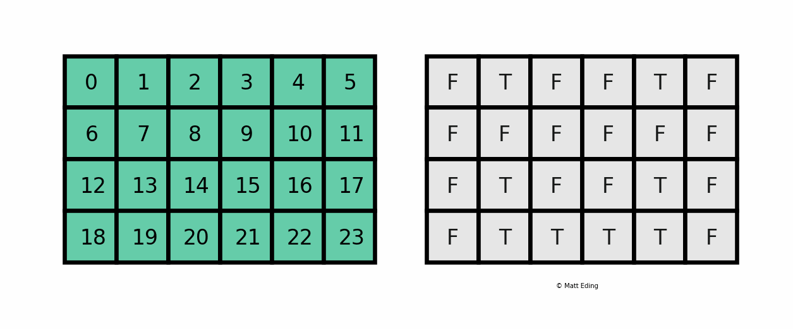

<div class="cell markdown">


<h1><center>Session 3</center></h1>

<h1><center>Log interpretation</center></h1>

**Course creator and speaker:** Manuel David Soto. MSc in Geology,
University of Texas at Austin, USA.

**Organizer:** Ulises Berman. Student of Geophysical Eng, USB, Caracas,
Venezuela. President of the USB AAPG Student Chapter

<a  id="toc"></a>

<h3>Table of content</h3>

  - [1 Log analysis with Python](#loganal)
      - [1.1 Well information loading and verification](#well)
          - [1.1.1 Loading logs and core data](#load)
          - [1.1.2 Variables verification](#varver)
          - [1.1.3 Input logs and core display](#indis)
      - [1.2 Interval re selection](#inter)
      - [1.3 Input logs histograms](#inhist)
      - [1.4 Input logs cross plots](#incross)
  - [2 Parameter selection](#par)
      - [2.1 Selection by local UDF](#local)
      - [2.2 Selection by global UDF](#global)
  - [3 Output logs](#output)
      - [3.1 Output logs calculation](#cal)
      - [3.2 Summary and report](#sum)
      - [3.3 Output logs cross plots](#outcross)
      - [3.4 Output logs display](#outdis)
  - [4 Simple estimation of rock typing and K](#rtk)

</div>

<div class="cell markdown">

<a  id="loganal"></a>

<h1> 1 Log analysis with Python</h1>

In the context of the Oil and Gas industry, **by log analysis or
interpretation we understand the geosciences discipline that integrate
and interpret all the data acquired in the initial live of the wells**
(while and after drilling) and before the long-term production test.
Among others, the responsibilities of log analyst are:

  - Describe the hole condition
  - Identify the lithology of the drilled section (type, arrangement)
  - Identify possible reservoirs (rock with high storage and flow
    capacity)
  - Identify the fluids in the reservoirs (oil, gas, water)
  - Make an estimation of the amount of resources available (amount of
    pay)

In order to fulfill these responsibilities, the analyst has to follow a
step by step process that require a constant verification with the
available data (regional data, offset wells, core data, fluid samples,
...). This process can be visualized in the following figure:


**In the last years Python has gain importance in the log analysis
because:**

  - Python and its powerful libraries are FREE
  - It provides an excellent platform for teaching, develop and testing
    new procedures and algorithms
  - Most important programs for log analysis incorporate utilities to
    code with Python user defined programs
  - ML applications are gaining importance in log analysis, Python is
    one of the main programing language for such advance applications.

**Some of these estimations, procedures, and Python codes are also
applicable to other industries such as geothermal, civil engineering,
mining, and in any discipline in which you need to do holes in the earth
and make measurements.**

</div>

<div class="cell markdown">

<a  id="well"></a>

<h2> 1.1 Well information</h2>

The amount of data generated in the initial live of a well is huge, in
type as well as format, been the logs the only data with a well
established standard format. As part of this universe we have:

  - Well location and elevation
  - Deviation survey (well trajectory)
  - While drilling, case hole, and **open hole logs**. All in LAS (Log
    ASCII Standard) or DLIS (Digital Log Interchange Standard) format
  - Mudlog (lithology vs. depth)
  - Formation tops
  - **Continuous or side wall cores (SWC)**
  - Pressures and temperatures
  - Fluid samples
  - Short-term production test (DST)
  - ...

Here we are going to work only with open hole logs and core data

</div>

<div class="cell markdown">

<a  id="load"></a>

<h3> 1.1.1 Loading logs and core data</h3>

There are libraries to load the logs in LAS format, however here we are
going to do it in the simpler way, discarding most of the header of the
LAS, and just leaving a line with the name of the individual curves:

</div>

<div class="cell markdown">

<a  id="import"></a>

#### Good import statement styling

</div>

<div class="cell code">

``` python
# Standard library import

import sys

# External library import

import matplotlib.pyplot as plt
import numpy as np
import pandas as pd
from PIL import Image
from sklearn.metrics import mean_squared_error
from sklearn.metrics import r2_score

# User defined function or application import

sys.path.insert(1, '../UDF/')    # The path of this function have to be written in Unix style
import udf
```

</div>

<div class="cell markdown">

#### Relative vs. absolute path

Relative or short paths works if are defined in or above your working
directory:

    '../User_defined_functions/'

Absolute or full path works only if they are defined in your computer:

    C:\Users\ry03107\Documents\Python\Cursos\USB_AAPG\NB\User_defined_functions

More info at:
<https://www.earthdatascience.org/courses/intro-to-earth-data-science/python-code-fundamentals/work-with-files-directories-paths-in-python/>

</div>

<div class="cell code">

``` python
# Loading logs without header

data_log = np.genfromtxt('Input\logs_w_csg.txt', skip_header=1, dtype=np.float32)

# Allocate different columns to different variables (logs)

depth = data_log[:, 0]
bs = data_log[:, 1]
cal = data_log[:, 2]
dden = data_log[:, 3]
den = data_log[:, 4]
dt = data_log[:, 5]
gr = data_log[:, 6]
nphi = data_log[:, 7]
pef = data_log[:, 8]
deep_res = data_log[:, 9]
mid_res = data_log[:, 10]
shalow_res = data_log[:, 11]

# Data samples and range (necessary for loops)

samples = len(data_log)
interval = depth[samples - 1] - depth[0]
step = depth[2] - depth[1]
top_interval = depth[0]
base_interval = depth[samples - 1]
```

</div>

<div class="cell markdown">

**Core data** is usually delivered by Labs in Excel files. Pandas has a
wonderful function that can read the content of the clipboard generated
in Excel and save it directly to a dataframe. Just open the Excel file,
select the columns you are interested (included the name of the variable
with no spaces), copy them, and then run the following command (Thanks
to Edmundo Peralta):

</div>

<div class="cell code">

``` python
# This is the 3rd way that we have seen to load data in Python

df_core = pd.read_clipboard(sep='\t')

# You still can use the previous command: dfcore = pd.read_excel('Input/core.xlsx', sheet_name='Sheet1')

df_core
```

</div>

<div class="cell code">

``` python
# Converting the series to arrays

core_depth = np.array(df_core['depth'])
core_phi = np.array(df_core['phi'])/100
core_k = np.array(df_core['k'])
```

</div>

<div class="cell code">

``` python
core_phi
```

</div>

<div class="cell code">

``` python
# Unification of the core depth to the logs depth, it is necesary to plot log vs. core data (provisional)

core_phi_log = np.empty(len(depth))
core_k_log = np.empty(len(depth))

core_phi_log[:] = np.NaN
core_k_log[:] = np.NaN

for i in range(0, len(depth)-1):
    for j in range(0, len(core_depth)):
        if core_depth[j] >= depth[i] and core_depth[j] < depth[i+1]:
            core_phi_log[i] = core_phi[j]
            core_k_log[i] = core_k[j]
```

</div>

<div class="cell code">

``` python
core_k
```

</div>

<div class="cell code">

``` python
core_k_log
```

</div>

<div class="cell code">

``` python
print('Core samples: ', len(core_phi), 'vs.','Core log samples: ', len(core_phi_log),'\n')

print('NaN in the Core log data: ', len(core_phi_log) - len(core_phi))
```

</div>

<div class="cell markdown">

<a  id="varver"></a>

<h3> 1.1.2 Variables verification</h3>

In log interpretation, once the variables (logs, cores or constants) are
created, it is necessary to verify them constantly. You can do this
printing the variables and their properties, however this would be
highly inefficient. A better way to track all the variables will be to
use the Variable Inspector tool provided by the Nbextensions (also
available in Spyder and other IDEs, Integrated Development
Environments). o install this library execute the following command in a
cmd window:

`pip install jupyter_contrib_nbextensions`

After installing the extensions , go to Edit in the NB Menu bar and then
nbextensions config. Click on the Variable Inspector button, this will
display a icon in the Tool bar, which allows you to activate or
deactivate the Variable Inspector tool:


</div>

<div class="cell code">

``` python
# GR variable verification

print('gr:', gr)
print()

gr_range = np.max(gr) - np.min(gr)

print('samples     =', len(gr))
print('range       =', gr_range)
print('min         =', np.min(gr))
print('p33         =', np.percentile(gr, 33))
print('mean        =', np.mean(gr))
print('p66         =', np.percentile(gr, 66))
print('max         =', np.max(gr))
print('std         =', np.std(gr))
print('mean + 3std =', (np.mean(gr) + 3*np.std(gr)))
```

</div>

<div class="cell code">

``` python
# pre_core phi verification

print('core_phi:', '\n', core_phi)
print()

core_phi_range = np.max(core_phi) - np.min(core_phi)

print('samples     =', len(core_phi))
print('range       =', core_phi_range)
print('min         =', np.min(core_phi))
print('p33         =', np.percentile(core_phi, 33))
print('mean        =', np.mean(core_phi))
print('p66         =', np.percentile(core_phi, 66))
print('max         =', np.max(core_phi))
print('std         =', np.std(core_phi))
print('mean + 3std =', (np.mean(core_phi) + 3*np.std(core_phi)))
```

</div>

<div class="cell code">

``` python
# pre_core k verification

print('core_k:', '\n', core_k)
print()

core_k_range = np.max(core_k) - np.min(core_k)

print('samples     =', len(core_k))
print('range       =', core_k_range)
print('min         =', np.min(core_k))
print('p33         =', np.percentile(core_k,33))
print('mean        =', np.mean(core_k))
print('p66         =', np.percentile(core_k,66))
print('max         =', np.max(core_k))
print('std         =', np.std(core_k))
print('mean + 3std =', (np.mean(core_k) + 3*np.std(core_k)))
```

</div>

<div class="cell code">

``` python
df_core.describe()
```

</div>

<div class="cell markdown">

<a  id="indis"></a>

<h3> 1.1.3 Input logs and core display</h3>

The simpler way to verify your input logs is to plot them together in a
multiplot.

Instead of plotting directly in the notebook, we are going to use
*Matplotlib qt* library to send all our plots to independent and more
flexible windows. The function of this library (also calls magic
command) is to provided general-purpose GUI (Graphic User Interface) for
the Python programs. To install this library execute the following
command in a cmd window:

`pip install pyqt5`

</div>

<div class="cell code">

``` python
# Single plot of gamma ray

plt.plot(gr, depth)
plt.ylim(5250, 4550)
```

</div>

<div class="cell code">

``` python
# Before continue let's make our Jupyter cells a bit bigger

from IPython.display import display, HTML

display(HTML(data="""
<style>
    div#notebook-container    { width: 95%; }
    div#menubar-container     { width: 65%; }
    div#maintoolbar-container { width: 60%; }
</style>
"""))
```

</div>

<div class="cell code">

``` python
# Activation of the Matplotlib qt UGI for the whole notebook

%matplotlib qt
```

</div>

<div class="cell code">

``` python
# Single and independent plot of gamma ray

plt.figure(1, figsize=(13, 8))

plt.plot(gr, depth)
plt.ylim(5250, 4550)
```

</div>

<div class="cell code" data-scrolled="true">

``` python
# Multiplot of the input logs with CSG and cores

top_display = 4550
base_display = 5250

plt.figure(2, figsize=(13, 8))

# Track 1
plt.subplot(1, 8, 1)
plt.plot(cal, depth, label='CAL')
plt.fill_betweenx(depth, cal, bs, where=bs >= cal,facecolor='brown', alpha=0.3)
plt.fill_betweenx(depth, cal, bs, where=bs <= cal, facecolor='blue', alpha=0.3)
plt.axis([7, 15, base_display, top_display])
plt.plot(bs, depth, 'r', label="BIT")
plt.title('BOREHOLE SIZE (inch)')
plt.legend()
plt.grid(True)

# Track 2
plt.subplot(1, 8, 2)
plt.plot(gr, depth)
plt.axis([0, 200, base_display, top_display])
plt.title('GR (api)')
plt.grid(True)

# Track 3
plt.subplot(1, 8, 3)
plt.semilogx(deep_res, depth, 'r', label="DEEP")
plt.semilogx(mid_res, depth, 'k', label="MID")
plt.semilogx(shalow_res, depth, label="SHAL")
plt.axis([1, 1000, base_display, top_display])
plt.title('RESISTIVITY (ohmm)')
plt.legend()
plt.grid(True)

# Track 4
plt.subplot(1, 8, 4)
plt.plot(nphi, depth)
plt.plot(core_phi_log, depth, '.', color='black', label = 'CORE')
plt.axis([0, 0.4, base_display, top_display])
plt.title('NPHI (v/V)')
plt.legend()
plt.grid(True)

# Track 5
plt.subplot(1, 8, 5)
plt.plot(den, depth)
plt.ylim(base_display, top_display)
plt.axis([1.8, 4.8, base_display, top_display])
plt.title('DEN (gr/cm3)')
plt.grid(True)

# Track 6
plt.subplot(1, 8, 6)
plt.plot(dden, depth)
plt.axis([-0.1, 0.3, base_display, top_display])
plt.title('DELTADEN (gr/cm3)')
plt.grid(True)

# Track 7
plt.subplot(1, 8, 7)
plt.plot(dt, depth)
plt.axis([50, 90, base_display, top_display])
plt.title('DT (US/ft)')
plt.grid(True)

# track 8
plt.subplot(1, 8, 8)
plt.plot(pef, depth)
plt.axis([0, 4, base_display, top_display])
plt.title('PEF')
plt.grid(True)

# plt.tight_layout(1)
# plt.show()
```

</div>

<div class="cell markdown" data-cell_style="center">

<a  id="inter"></a>

<h2> 1.2 Interval re selection</h2>

We have to eliminate the portion of the logs that were acquired inside
the casing (CSV). For this we use the **mask or filter tool** which has
the following syntax:

`new_array = array[condition]`

The mask can be visualized (from Matt Eding) as follow, after setting a
condition over a matrix, a new matrix is created with the items that met
the condition:



</div>

<div class="cell code">

``` python
# Re defining the data array by a mask or filter

data_log = data_log[depth >= 4600]
core_phi_log = core_phi_log[depth >= 4600]
core_k_log = core_k_log[depth >= 4600]

# Allocate different columns to different variables (logs)

depth = data_log[:, 0]
bs = data_log[:, 1]
cal = data_log[:, 2]
dden = data_log[:, 3]
den = data_log[:, 4]
dt = data_log[:, 5]
gr = data_log[:, 6]
nphi = data_log[:, 7]
pef = data_log[:, 8]
deep_res = data_log[:, 9]
mid_res = data_log[:, 10]
shalow_res = data_log[:, 11]

# Data samples and range (necessary for loops)

samples = len(data_log)
interval = depth[samples - 1] - depth[0]
step = depth[2] - depth[1]
top_interval = depth[0]
base_interval = depth[samples - 1]
```

</div>

<div class="cell code">

``` python
# Loading the mudlog image

mudlog = Image.open("Input/mudlog_4600_5250.png")
```

</div>

<div class="cell markdown">

The top of display interval of the logs has changed from 4545 to 4600
ft, activate the right `top_display`

</div>

<div class="cell code" data-scrolled="true">

``` python
# Multiplot of the input logs without CSG and cores

# top_display = 4550
top_display = 4600
base_display = 5250

plt.figure(3, figsize=(13, 8))

# Track 1
plt.subplot(1, 9, 1)
plt.imshow(mudlog, aspect='auto', extent=(1, 2, base_display, top_display))
plt.title('Mudlog')

# Track 2
plt.subplot(1, 9, 2)
plt.plot(cal, depth, label='CAL')
plt.fill_betweenx(depth, cal, bs, where=bs >= cal,facecolor='brown', alpha=0.3)
plt.fill_betweenx(depth, cal, bs, where=bs <= cal, facecolor='blue', alpha=0.3)
plt.axis([7, 15, base_display, top_display])
plt.plot(bs, depth, 'r', label="BIT")
plt.title('BOREHOLE SIZE (inch)')
plt.legend()
plt.grid(True)

# Track 3
plt.subplot(1, 9, 3)
plt.plot(gr, depth)
plt.axis([0, 200, base_display, top_display])
plt.title('GR (api)')
plt.grid(True)

# Track 4
plt.subplot(1, 9, 4)
plt.semilogx(deep_res, depth, 'r', label="DEEP")
plt.semilogx(mid_res, depth, 'k', label="MID")
plt.semilogx(shalow_res, depth, label="SHAL")
plt.axis([1, 1000, base_display, top_display])
plt.title('RESISTIVITY (ohmm)')
plt.legend()
plt.grid(True)

# Track 5
plt.subplot(1, 9, 5)
plt.plot(nphi, depth)
plt.plot(core_phi_log, depth, '.', color='black', label = 'CORE')
plt.axis([0, 0.4, base_display, top_display])
plt.title('NPHI (v/V)')
plt.legend()
plt.grid(True)

# Track 6
plt.subplot(1, 9, 6)
plt.plot(den, depth)
plt.ylim(base_display, top_display)
plt.axis([1.8, 2.8, base_display, top_display])
plt.title('DEN (gr/cm3)')
plt.grid(True)

# Track 7
plt.subplot(1, 9, 7)
plt.plot(dden, depth)
plt.axis([-0.1, 0.3, base_display, top_display])
plt.title('DELTADEN (gr/cm3)')
plt.grid(True)

# Track 8
plt.subplot(1, 9, 8)
plt.plot(dt, depth)
plt.axis([50, 90, base_display, top_display])
plt.title('DT (US/ft)')
plt.grid(True)

# track 9
plt.subplot(1, 9, 9)
plt.plot(pef, depth)
plt.axis([0, 4, base_display, top_display])
plt.title('PEF')
plt.grid(True)

# plt.tight_layout(1)
# plt.show()
```

</div>

<div class="cell markdown" data-cell_style="center">

<a  id="inhist"></a>

<h2> 1.3 Input logs histograms </h2>

Histograms should be the next step to understand your input logs. As
well as the logs, they can be combined in a multiplot:

</div>

<div class="cell code">

``` python
plt.figure(4, figsize=(21, 13))

plt.subplot(2,3,1)
plt.hist(cal, bins=20)
plt.axvline(x=np.mean(cal)-np.std(cal), ls = "--", color='red',label='mean-std')
plt.axvline(x=np.mean(cal), ls = "--", color='black',label='mean')
plt.axvline(x=np.mean(cal)+np.std(cal), ls = "--", color='blue',label='mean+std')
plt.xlim(6, 16)
plt.xlabel('CAL (inch)')
plt.ylabel('Frequency')
plt.grid(True)
plt.legend()

plt.subplot(2,3,2)
plt.hist(gr, bins=20)
plt.axvline(x=np.mean(gr)-np.std(gr), ls = "--", color='red')
plt.axvline(x=np.mean(gr), ls = "--", color='black')
plt.axvline(x=np.mean(gr)+np.std(gr), ls = "--", color='blue')
plt.xlim(0, 180)
plt.xlabel('GR (api)')
plt.grid(True)

plt.subplot(2,3,3)
plt.hist(pef, bins=20)
plt.axvline(x=np.mean(pef)-np.std(pef), ls = "--", color='red')
plt.axvline(x=np.mean(pef), ls = "--", color='black')
plt.axvline(x=np.mean(pef)+np.std(pef), ls = "--", color='blue')
plt.xlim(0, 4)
plt.xlabel ('PEF')
plt.grid(True)

plt.subplot(2,3,4)
plt.hist(nphi, bins=20)
plt.axvline(x=np.mean(nphi)-np.std(nphi), ls = "--", color='red')
plt.axvline(x=np.mean(nphi), ls = "--", color='black')
plt.axvline(x=np.mean(nphi)+np.std(nphi), ls = "--", color='blue')
plt.xlim(0, 0.4)
plt.xlabel ('NPHI (v/v)')
plt.ylabel('Frequency')
plt.grid(True)

plt.subplot(2,3,5)
plt.hist(den, bins=20)
plt.axvline(x=np.mean(den)-np.std(den), ls = "--", color='red')
plt.axvline(x=np.mean(den), ls = "--", color='black')
plt.axvline(x=np.mean(den)+np.std(den), ls = "--", color='blue')
plt.xlim(1.8, 2.8)
plt.xlabel ('DEN (g/cm3)')
plt.grid(True)

plt.subplot(2,3,6)
plt.hist(deep_res)
plt.axvline(x=np.mean(deep_res)-np.std(deep_res), ls = "--", color='red')
plt.axvline(x=np.mean(deep_res), ls = "--", color='black')
plt.axvline(x=np.mean(deep_res)+np.std(deep_res), ls = "--", color='blue')
# plt.xscale('log')
plt.xlabel ('DEEP RES (ohmm)')
plt.grid(True)

#plt.tight_layout(1)
plt.show()
```

</div>

<div class="cell markdown" data-cell_style="center">

<a  id="incross"></a>

<h2> 1.4 Input logs cross plots </h2>

Cross plots provide an extra and detail view of your input logs. They
help to the identification of the lithology, finding anomalies, and in
the selection of parameters needed in the calculations of output logs.

Some of the shown cross plot have reference layouts (lines) that are
just extra plots over the cross plots. These layout, saved in the folder
of the same name, were acquired (as x and y pairs) from classic plot
using the following digitalization tool:

<https://automeris.io/WebPlotDigitizer/>

</div>

<div class="cell code">

``` python
# Input logs cross plots

# neu vs. den xpolt

plt.figure(5, figsize=(21, 13))

plt.subplot(2, 3, 1)
plt.plot(nphi, den, '.')
plt.ylim(3, 1.8)
plt.xlim(-0.1, 0.6)
plt.xlabel('NPHI')
plt.ylabel('DEN (g/cm3)')
plt.grid(True)

# loading the layout

neu2den_qz = np.genfromtxt('Layouts/neu2den_qz.csv',delimiter=',', dtype=np.float32)
neu2den_cal = np.genfromtxt('Layouts/neu2den_cal.csv', delimiter=',', dtype=np.float32)
neu2den_dol = np.genfromtxt('Layouts/neu2den_dol.csv', delimiter=',', dtype=np.float32)

# Ploting the layout and its labels

plt.plot(neu2den_qz[:, 0], neu2den_qz[:, 1], 'black')
plt.text(-0.08, 2.55, 'Quartz')
plt.plot(neu2den_cal[:, 0], neu2den_cal[:, 1], 'black')
plt.text(-0.08, 2.75, 'Calcite')
plt.plot(neu2den_dol[:, 0], neu2den_dol[:, 1], 'black')
plt.text(-0.08, 2.91, 'Dolomite')

# pef vs. den xpolt

plt.subplot(2, 3, 2)
plt.plot(pef, den, '.')
plt.ylim(3, 1.8)
plt.xlim(1, 6)
plt.xlabel('PEF')
plt.ylabel('DEN (g/cm3)')
plt.grid(True)

# loading the layout

pef2den_qz = np.genfromtxt('layouts/pef2den_qz.csv', delimiter=',', dtype=np.float32)
pef2den_cal = np.genfromtxt('layouts/pef2den_cal.csv', delimiter=',', dtype=np.float32)
pef2den_dol = np.genfromtxt('layouts/pef2den_dol.csv', delimiter=',', dtype=np.float32)
pef2den_sal = np.genfromtxt('layouts/pef2den_sal.csv', delimiter=',', dtype=np.float32)
pef2den_anh = np.genfromtxt('layouts/pef2den_anh.csv', delimiter=',', dtype=np.float32)

# Ploting the layout and its labels

plt.plot(pef2den_qz[:, 0], pef2den_qz[:, 1], 'black')
plt.text(1.6, 2.7, 'Quartz')
plt.plot(pef2den_cal[:, 0], pef2den_cal[:, 1], 'black')
plt.text(5, 2.75, 'Calcite')
plt.plot(pef2den_dol[:, 0], pef2den_dol[:, 1], 'black')
plt.text(3, 2.91, 'Dolomite')
plt.plot(pef2den_sal[:, 0], pef2den_sal[:, 1], 'black')
plt.text(4.75, 2.07, 'Salt')
plt.plot(pef2den_anh[:, 0], pef2den_anh[:, 1], 'black')
plt.text(5.1, 2.93, 'Anhydrite')

# %% Other plots

plt.subplot(2, 3, 3)
plt.plot(dt, den, '.')
plt.ylim(2.8, 1.8)
plt.xlim(50, 100)
plt.xlabel('DT(msec/ft)')
plt.ylabel('DEN (g/cm3)')
plt.grid(True)

plt.subplot(2, 3, 4)
plt.semilogx(deep_res, gr, '.')
plt.xlim(1, 1000)
plt.ylim(0, 160)
plt.xlabel('DEEP RES (ohmm)')
plt.ylabel('GR (api)')
plt.grid(True)

plt.subplot(2, 3, 5)
plt.plot(dt, gr, '.')
plt.xlim(50, 100)
plt.ylim(0, 160)
plt.xlabel('DT(msec/ft)')
plt.ylabel('GR (api)')
plt.grid(True)

plt.show()
```

</div>

<div class="cell markdown">

<h2>End of part </h2>

[Return to Table of Content](#toc)

</div>

<div class="cell markdown" data-cell_style="center">

<a  id="par"></a>

<h1> 2 Parameter selection </h1>

By printing the main statistical parameters and histograms of the logs
and masked or filter logs, you can answer questions such as:

``` 
                 What is the resistivity of the shales?
                 What is the sonic of the sands?
                 ...
                 
```

In order to answer the first question you can use the fact that shales
have high Gamma Ray values (gr):

</div>

<div class="cell markdown">

<a  id="local"></a>

<h2> 2.1 Selection by local UDF </h2>

Local functions can be used many times in the same Notebook.

</div>

<div class="cell code">

``` python
# local function for main statistical parameters

def local_stat(l):
    
    l_range = np.max(l) - np.min(l)

    # Stat of l
    
    print('samples     =', len(l))
    print('range       =', l_range)
    print('min         =', np.min(l))
    print('p33         =', np.percentile(l,33))
    print('mean        =', np.mean(l))    
    print('p66         =', np.percentile(l,66))    
    print('max         =', np.max(l))
    print('std         =', np.std(l))
    print('mean + 3std =', (np.mean(l) + 3*np.std(l)))
```

</div>

<div class="cell code" data-scrolled="true">

``` python
# Main statistical parameters of Gamma Ray

local_stat(gr)
```

</div>

<div class="cell code">

``` python
# Main statistical parameters of Deep Resistivity

local_stat(deep_res)
```

</div>

<div class="cell code">

``` python
# Main statistical parameters of mask Deep Resistivity
  
# An alternatively to avoid NaN is this command: sub_var = var[~np.isnan(var)]

deep_res_shale = deep_res[gr > 100]

local_stat(deep_res_shale)
```

</div>

<div class="cell code">

``` python
# Local function to do the all the previous processes in one shot and add some plots

def local_mask_stat(l, label, ml):
    
    # l is an array, ml is a subset of l (mask or filter l), label is an string

    log_range = np.max(l) - np.min(l)

    # Report of l
    
    file = open('Output/'+label+'_stat.txt', "w")
    
    file.writelines("Statistics of "+label+" \n")
    file.writelines(" \n")
    file.writelines("Minimum value          :"+str(np.min(l))+" \n")   
    file.writelines("P33                    :"+str(np.percentile(l,33))+" \n")      
    file.writelines("Mean                   :"+str(np.mean(l))+" \n")   
    file.writelines("P66                    :"+str(np.percentile(l,66))+" \n")    
    file.writelines("Maximum value          :"+str(np.max(l))+" \n")
    file.writelines("Range                  :"+str(log_range)+" \n")
    file.writelines("Standard deviation     :"+str(np.std(l))+" \n")
    file.writelines("Mean + 3std            :" + str((np.mean(l) + 3*np.std(l)))+" \n")     
    file.writelines(" \n")

    # Report of ml (filter l)
    
    ml_range = np.max(ml) - np.min(ml)

    file.writelines("Statistics of filter "+label+" \n")
    file.writelines(" \n")
    file.writelines("Minimum value          :"+str(np.min(ml))+" \n")
    file.writelines("P33                    :"+str(np.percentile(ml,33))+" \n")      
    file.writelines("Mean                   :"+str(np.mean(ml))+" \n")   
    file.writelines("P66                    :"+str(np.percentile(ml,66))+" \n")   
    file.writelines("Maximum value          :"+str(np.max(ml))+" \n")
    file.writelines("Range                  :"+str(ml_range)+" \n")
    file.writelines("Mean                   :"+str(np.mean(ml))+" \n")
    file.writelines("Standard deviation     :"+str(np.std(ml))+" \n")
    file.writelines("Mean + 3std            :" +str((np.mean(ml) + 3*np.std(ml)))+" \n")
                    
    file.close()

    # Histogran of l
    
#      %matplotlib inline
    
    plt.subplot(1, 2, 1)
    plt.hist(l)
    plt.axvline(x=np.mean(l)-np.std(l), ls="--", color='red', label='mean-std')
    plt.axvline(x=np.mean(l), ls="--", color='black', label='mean: '+str(np.mean(l)))
    plt.axvline(x=np.mean(l)+np.std(l), ls="--",color='blue', label='mean+std')        
    plt.xlabel('original '+label.lower())
    plt.ylabel('frequency')
    plt.legend()
    plt.grid(True)

    # Histogran of ml (filter l)
    
    plt.subplot(1, 2, 2)
    plt.hist(ml)
    plt.axvline(x=np.mean(ml)-np.std(ml), ls="--", color='red', label='mean-std')
    plt.axvline(x=np.mean(ml), ls="--", color='black', label='mean: '+str(np.mean(ml)))
    plt.axvline(x=np.mean(ml)+np.std(ml), ls="--", color='blue', label='mean+std')
    plt.xlabel('filter '+label.lower())
    plt.ylabel('frequency')
    plt.legend()
    plt.grid(True)
    
    plt.show()

    return
```

</div>

<div class="cell code">

``` python
# Let's try with the another value of GR

deep_res_shale = deep_res[gr > 100]

plt.figure(6, figsize=(13, 8))

local_mask_stat(deep_res, 'deep_res', deep_res_shale)
```

</div>

<div class="cell code" data-scrolled="true">

``` python
# The other question

nphi_shale = nphi[gr > 100]

plt.figure(6, figsize=(13, 8))

local_mask_stat(nphi, 'nphi', nphi_shale)
```

</div>

<div class="cell markdown">

<a  id="global"></a>

<h2> 2.2 Selection by global function </h2>

Global functions can be defined once and then used by all notebooks. For
that you have to do the following at the beginning of the nb:

  - Import the sys standard library
  - Declare the location of the global udf.py (Python file with the
    UDFs)
  - Import the udf.py

[Go to import](#import)

After the previous you can finally call and specific UDF within the
udf.py

</div>

<div class="cell code" data-scrolled="true">

``` python
# Statistics of deep resistivity by global UDF

udf.global_stat(deep_res)
```

</div>

<div class="cell code">

``` python
# Statistics of mask deep resistivity by global UDF

deep_res_shale = deep_res[gr > 100]

plt.figure(6, figsize=(13, 8))

udf.global_mask_stat(deep_res, 'deep res', deep_res_shale)
```

</div>

<div class="cell markdown">

<h2>End of subpart </h2>

[Return to Table of Content](#toc)

</div>

<div class="cell markdown">

<a  id="output"></a>

<h1>3 Output logs</h1>

By output logs we understand the logs that are calculated from the
original logs (input), those acquired in the well. The main three output
logs or curves that we are going to compute, and its required input
logs, are:

  - Volume of shale (vsh): gamma ray (gr) , spontaneous potential (sp)
  - Porosity (phi): neutron porosity (nphi), density (den), sonic (dt)
  - Water saturation (sw): deep resistivity (deep\_res)

</div>

<div class="cell markdown">

<a  id="cal"></a>

<h2>3.1 Output logs calculation </h2>

There are several equations or models (some very complex) for each of
three output logs. For this demonstration we are going to use the
simplest possible, which can be seen in the following cell

</div>

<div class="cell code">

``` python
# Volume of shale by gamma ray

gr_cl = 17    # gr clean or minimum
gr_sh = 157    # gr of shales or maximum

vsh = (gr - gr_cl)/(gr_sh - gr_cl)    # Similar to the unity-base normalization

vsh = np.maximum(np.minimum(vsh, 1), 0.0001)   # Restreing the result  between (0,1]
```

</div>

<div class="cell code">

``` python
# Total sonic porosity

dt_qz = 56    # sonic of quartz
dt_f = 218    # sonic of water

sphi = (dt - dt_qz)/(dt_f - dt_qz)

sphi = np.maximum(np.minimum(sphi, 1), 0.0001)
```

</div>

<div class="cell markdown">

To compute the effective porosity you have to subtract the porosity of
the shale from the total porosity. To find the porosity of the shale you
can use a UDF as the one defined above, `stat_fstat`.

</div>

<div class="cell code">

``` python
# Total sonic porosity of the shale

local_stat(sphi)
```

</div>

<div class="cell code">

``` python
sphi_shale = sphi[gr > 100]

local_stat(sphi_shale)
```

</div>

<div class="cell code">

``` python
# Effective sonic porosity

sphi_sh = 0.082

eff_sphi = sphi - sphi_sh*vsh

eff_sphi = np.maximum(np.minimum(eff_sphi, 1), 0.0001)
```

</div>

<div class="cell code">

``` python
# Total Neutron-density porosity

d_m = 2.65
d_f = 1

dphi = (d_m - den)/(d_m - d_f)

ndphi = (dphi + nphi)/2

ndphi = np.maximum(np.minimum(ndphi, 1), 0.0001)
```

</div>

<div class="cell code">

``` python
# Total neutron-density porosity of the shale

local_stat(ndphi)
```

</div>

<div class="cell code">

``` python
ndphi_shale = ndphi[gr > 100]

local_stat(ndphi_shale)
```

</div>

<div class="cell code">

``` python
# Effective neutron-density porosity

ndphi_sh = 0.109

eff_ndphi = ndphi - ndphi_sh*vsh

eff_ndphi = np.maximum(np.minimum(eff_ndphi, 1), 0.0001)
```

</div>

<div class="cell markdown">

To improve the estimation of porosity in the bad hole intervals we use
the sonic porosity instead of the neutron-density porosity:

</div>

<div class="cell code">

``` python
#### Porosity along bad hole intervals

dcal = cal - bs

# %matplotlib inline

plt.figure(7, figsize=(13, 8))
plt.plot(dden,dcal, '.')
plt.ylabel('DCAL(inch)')
plt.xlabel('DELTADEN(gr/cm3)')
plt.axhline(y=1, ls="--", color='red')
plt.axvline(x=0.075, ls="--", color='red')
plt.text(0.22, 3.5, 'BAD HOLE AREA', color='red')
plt.grid(True)
plt.show()
```

</div>

<div class="cell code">

``` python
# Composite (made of several) porosity address the bad hole intervals

badhole = np.zeros(samples)
comp_phi = np.zeros(samples)
comp_eff_phi = np.zeros(samples)

for i in range(0, samples):
    if (dcal[i] > 1 and dden[i] > 0.075):
        badhole[i] = 1
        comp_phi[i] = sphi[i]
        comp_eff_phi[i] = eff_sphi[i]
        
    else:
        badhole[i] = 0
        comp_phi[i] = ndphi[i]
        comp_eff_phi[i] = eff_ndphi[i]
```

</div>

<div class="cell markdown">

Which porosity is most similar to the core porosity, the total
(comp\_phi) or the effective (comp\_eff\_phi)?

</div>

<div class="cell code">

``` python
# In order the calculate the correlation coefficient it is necessary match the real values of the core_phi with the comp_phi (total porosity from the logs)

sub_comp_phi = comp_phi[core_phi_log>=0]

np.corrcoef(sub_comp_phi, core_phi)
```

</div>

<div class="cell code">

``` python
sub_comp_eff_phi = comp_eff_phi[core_phi_log>=0]

np.corrcoef(sub_comp_eff_phi, core_phi)
```

</div>

<div class="cell code">

``` python
# Is core phi closer to total or effective log porosity?

# %matplotlib inline

plt.figure(8, figsize=(13, 8))

x45 = [0, 1]
y45 = x45

plt.subplot(1, 2, 1)
plt.scatter(core_phi_log, comp_phi, c=vsh, cmap='viridis_r')
plt.plot(x45, y45, 'gray', linewidth=0.5)
plt.axis([0, 0.25, 0, 0.25])
plt.xlabel('CORE PHI (v/v)')
plt.ylabel('TOTAL PHI (v/v)')
plt.grid(True)

plt.subplot(1, 2, 2)
plt.scatter(core_phi_log, comp_eff_phi, c=vsh, cmap='viridis_r')
plt.plot(x45, y45, 'gray', linewidth=0.5)
plt.axis([0, 0.25, 0, 0.25])
plt.xlabel('CORE PHI (v/v)')
plt.ylabel('EFFECTIVE PHI (v/v)')
plt.grid(True)

# Color scale bar

cb = plt.colorbar()
cb.set_label('vsh')

plt.show()
```

</div>

<div class="cell code">

``` python
# Temperature (ºC) along the well

mrt = 104
mrtd = 5250

geo_grad = (mrt - 25)/mrtd
temp = geo_grad*depth + 25
```

</div>

<div class="cell markdown">

<b>The Archie´s equation</b> is most the important equation in the log
analysis because it gave the first way to access the amount of oil
present in a subsurface rocks (clean sandstones) :


</div>

<div class="cell markdown">

Before computing the saturation we have to have a value for the
resistivity of the formation water (Rw). If you don't have a sample you
have to look for a water bearing interval and do the estimation of the
Rw there:

</div>

<div class="cell code">

``` python
# Selection of a water bearing interval

fix = 4900    # Depth of the estimation
print('ro =', deep_res[depth == fix])
print('phi =', comp_eff_phi[depth == fix])
print('temp =', temp[depth == fix])

plt.figure(9, figsize=(13, 8))
plt.semilogx(deep_res, gr, '.')
plt.semilogx(deep_res[depth == fix], gr[depth == fix], 'rs', markersize=5)
plt.text(1.8, 31, 'Water sand', color='red')
plt.xlim(1, 1000)
plt.ylim(0, 160)
plt.xlabel('DEEP RES (ohmm)')
plt.ylabel('GR (api)')
plt.grid(True)
plt.show()
```

</div>

<div class="cell code">

``` python
# Rw estimation

ro_fix = 3.32    # Resistivity at the fix depth
phi_fix = 0.15    # Porosity at the fix depth
temp_fix = 98.73    # Temperature at the fix depth

# Archie's equation constants

a = 1
m = 2
n = 2

rw_fix = ro_fix*(phi_fix**m)    # Archie equation in water bearing sands

rw = rw_fix*(temp_fix + 21.5)*(1/(temp + 21.5))    # Rw along the well for temperature in ºC
```

</div>

<div class="cell code">

``` python
# Water saturation by the Archie's equation in oil bearing sands

sw = ((rw/deep_res)*(a/(comp_eff_phi**m)))**(1/n)
sw = np.maximum(np.minimum(sw, 1), 0.0001)
```

</div>

<div class="cell markdown">

<a  id="sum"></a>

<h2>3.2 Summation and report </h2>

The summation is a classification process in wich you can have a idea of
the resources available in the well. This process can be esquematized in
the following figure:


</div>

<div class="cell code">

``` python
# Cutoffs, they change from zone to zone. If you don´t have then use the lower third of the curve

# %matplotlib inline

plt.figure(10, figsize=(21, 8))

plt.subplot(1,3,1)
plt.hist(vsh)
plt.axvline(x=np.percentile(vsh, 33), ls="--", color='red', label='p33: '+str(np.percentile(vsh, 33)))
plt.legend()
plt.xlim(0, 1)
plt.xlabel('VSH (v/v)')
plt.grid(True)

plt.subplot(1,3,2)
plt.hist(comp_eff_phi)
plt.axvline(x=np.percentile(comp_eff_phi, 33), ls="--", color='red', label='p33: '+str(np.percentile(comp_phi, 33)))
plt.legend()
#plt.xlim(0, 0.4)
plt.xlabel('EFFECTIVE PHI (v/v)')
plt.grid(True)

plt.subplot(1,3,3)
plt.hist(sw)
plt.axvline(x=np.percentile(sw, 66), ls="--", color='red', label='p66: '+str(np.percentile(sw, 66)))
plt.legend()
plt.xlim(0, 1)
plt.xlabel('SW (v/v)')
plt.grid(True)

#plt.tight_layout(1)
plt.show()
```

</div>

<div class="cell code" data-scrolled="true">

``` python
# Simple_stat to find the lower third of the curve

local_stat(vsh)
```

</div>

<div class="cell code" data-scrolled="true">

``` python
# Simple_stat to find the lower third of the curve

local_stat(comp_phi)
```

</div>

<div class="cell code" data-scrolled="true">

``` python
# Simple_stat to find the lower third of the curve

local_stat(sw)
```

</div>

<div class="cell code" data-cell_style="center">

``` python
# Summation, counting sand, reservoir, and pay

# Cutoffs, they change from zone to zone. If you don´t have then use the lower third of the curve

vsh_ct = 0.20
phi_ct = 0.10
sw_ct = 0.66

sand = np.zeros(samples)    # Sand counter
res = np.zeros(samples)    # Reservoir counter
pay = np.zeros(samples)    # Pay or reservoir with oil counter

for i in range(0, samples):

    if vsh[i] < vsh_ct:
        sand[i] = 1
    else:
        sand[i] = 0

    if sand[i] == 1 and comp_eff_phi[i] > phi_ct:
        res[i] = 1
    else:
        res[i] = 0

    if res[i] == 1 and sw[i] < sw_ct:
        pay[i] = 1
    else:
        pay[i] = 0

# Summe of the counters

total_sand = step*sum(sand)
total_res = step*sum(res)
total_pay = step*sum(pay)
```

</div>

<div class="cell code">

``` python
# Final report of parameters and results

file = open("Output/report.txt", "w")

file.writelines("REPORT\n")
file.writelines(" \n")
file.writelines("RANGE\n")
file.writelines("\n")
file.writelines("           top_interval:   "+str(top_interval)+" \n")
file.writelines("          base_interval:   "+str(base_interval)+" \n")
file.writelines("               interval:   "+str(interval)+" \n")
file.writelines("                   step:   "+str(step)+" \n")
file.writelines("                samples:   "+str(samples)+" \n")
file.writelines("\n")
file.writelines("SHALE VOLUME\n")
file.writelines("\n")
file.writelines("                  gr_cl:   "+str(gr_cl)+" \n")
file.writelines("                  gr_sh:   "+str(gr_sh)+" \n")
file.writelines("\n")
file.writelines("WATER RESISTIVITY\n")
file.writelines("\n")
file.writelines("           estimation @:   "+str(fix)+" \n")
file.writelines("                     ro:   "+str(ro_fix)+" \n")
file.writelines("                    phi:   "+str(phi_fix)+" \n")
file.writelines("                     rw:   "+str(rw_fix)+" \n")
file.writelines("                   temp:   "+str(temp_fix)+" \n")
file.writelines("\n")
file.writelines("ARCHIE SW\n")
file.writelines("\n")
file.writelines("                      a:   "+str(a)+" \n")
file.writelines("                      m:   "+str(m)+" \n")
file.writelines("                      n:   "+str(n)+" \n")
file.writelines("\n")
file.writelines("SUMMATION CUTOFF\n")
file.writelines("\n")
file.writelines("                     vsh  <  "+str(vsh_ct)+" \n")
file.writelines("                     phi  >  "+str(phi_ct)+" \n")
file.writelines("                      sw  <  "+str(sw_ct)+" \n")
file.writelines("\n")
file.writelines("SUMMATION RESULTS\n")
file.writelines("\n")
file.writelines("                   sand:  "+str(total_sand)+" \n")
file.writelines("                    res:  "+str(total_res)+" \n")
file.writelines("               sand_ntg:  "+str(total_sand/interval)+" \n")
file.writelines("                    pay:  "+str(total_pay)+" \n")

file.close()
```

</div>

<div class="cell code">

``` python
# Executive summary

print('Cutoffs:')
print("vsh  <  ", vsh_ct)
print("phi  >  ", phi_ct)
print("sw  <  ", sw_ct, " \n")

print('Intervals:')

print('Total:', interval)
print('Sand:', total_sand)
print('Res:', total_res)
print('Sand_ntg:', total_sand/interval)
print('Pay:', total_pay)
```

</div>

<div class="cell code">

``` python
# Making & saving output logs

verify = np.zeros((samples, 7))
verify[:, 0] = depth
verify[:, 1] = vsh
verify[:, 2] = comp_phi
verify[:, 3] = sw
verify[:, 4] = sand
verify[:, 5] = res
verify[:, 6] = pay

np.savetxt('Output/output_logs.txt', (verify), delimiter=',',
           header='depth,vsh,comp_phi,sw,sand,reservoir,pay', fmt='%1.3f')
```

</div>

<div class="cell markdown">

<a  id="outcross"></a>

<h2>3.3 Output logs cross plots </h2>

As well as the input log, you can do cross plot with the output log or
with a mix of them:

</div>

<div class="cell code">

``` python
# Two input-output logs cross plot

# %matplotlib inline

plt.figure(11, figsize=(13, 8))

plt.subplot(1, 2, 1)
plt.scatter(deep_res, vsh, c=vsh, cmap='viridis_r')
plt.xscale("log") 
plt.axis([1, 1000, 0, 1])
plt.xlabel('DEEP RES (ohmm)')
plt.ylabel('VSH (v/v)')
plt.title('Sand with water, shales & sand with water')
plt.grid(True)

# Scatter plot, logx logy plot with the color of the point controled by z (vsh) 

plt.subplot(1, 2, 2)
plt.scatter(deep_res, comp_eff_phi, c=vsh, cmap='viridis_r')
#plt.xlim(1, 1000)
plt.ylim(0.01, 1)
plt.yscale("log")
plt.xscale("log") 
plt.xlabel('DEEP RES (ohmm)')
plt.ylabel('EFFECTIVE PHI (v/v)')
plt.title('Graphic form of the Archie equation')
plt.grid(True)

# Color scale bar

cb = plt.colorbar()
cb.set_label('vsh')

plt.show()
```

</div>

<div class="cell markdown">

<a  id="outdis"></a>

<h2>3.4 Output logs display </h2>

As well as the input log, the output can be displayed in a multiplot:

</div>

<div class="cell code" data-scrolled="true">

``` python
# Multiplo display of the output log

plt.figure(12, figsize=(21,13))

# Simple display of the output logs

# Track 1
plt.subplot(1, 7, 1)
plt.imshow(mudlog, aspect='auto', extent=(1, 2, base_display, top_display))
plt.title('Mudlog')

# Track 2
plt.subplot(1,7,2)
plt.plot(badhole,depth)
plt.fill_betweenx(depth, badhole, where=badhole >= 0, facecolor='red',alpha=0.3)
plt.axis([0, 1, base_display, top_display])
plt.title ('BADHOLE')
plt.grid(True)

# Track 3
plt.subplot(1,7,3)
plt.plot(vsh,depth)
plt.axis([0, 1, base_display, top_display])
plt.title ('VSH(v/v)')
plt.grid(True)
plt.fill_betweenx(depth, vsh, 1, vsh >= vsh_ct, facecolor='green',alpha=0.3)
plt.fill_betweenx(depth, vsh, 1, vsh < vsh_ct, facecolor='orange',alpha=0.3)
plt.axvline(x=vsh_ct, ls="--", color='red', label='VSH_CT')
plt.legend()

# Track 4
plt.subplot(1,7,4)
plt.semilogx(deep_res, depth, 'r', label="DEEP")
plt.semilogx(mid_res, depth, 'k', label="MID")
plt.semilogx(shalow_res, depth, label="SHAL")
plt.axis([1, 1000, base_display, top_display])
plt.axhline(y= 4880, ls="--", color='blue', label='OWC')
plt.axhline(y= 4900, ls="--", color='black', label='RW')
plt.title('RESISTIVITY (ohmm)')
plt.legend()
plt.grid(True)

# Track 5
plt.subplot(1,7,5)
plt.plot(comp_phi,depth,'b', label='TOTAL')
plt.plot(comp_eff_phi,depth,'c', label='EFFECTIVE')
plt.plot(core_phi_log, depth, '.', color='black')
plt.axis([0, 0.25, base_display, top_display])
plt.axvline(x=phi_ct, ls="--", color='red', label='PHI_CT')
plt.title ('PHI(v/v)')
plt.legend()
plt.grid(True)

# Track 6
plt.subplot(1,7,6)
plt.plot(sw,depth)
plt.axis([1,0, base_display, top_display])
plt.axvline(x=sw_ct, ls="--", color='red', label='SW_CT')
plt.title ('SW(v/v)')
plt.legend()
plt.grid(True)

# Track 7
plt.subplot(1,7,7)
plt.plot(pay,depth)
plt.fill_betweenx(depth, pay, where=pay >= 0, facecolor='green',alpha=0.3)
plt.axis([0, 1, base_display, top_display])
plt.title('PAY (ft)')
plt.grid(True)
```

</div>

<div class="cell markdown">

<div class="alert alert-block alert-warning">
<font size="6"><p> &#127947;</font>
        <b> Exercise:</b>
Take the exercise_log.las file in the Input folder and try to do the previous calculations. First explore the las file to understand the parameters there. Make a txt copy and delete the header. After loading, focus only in the logs you need (be simple, compute only total porosity). Find a water sand to compute Rw (temperature is given as a log). Set up your cutoffs and find the feet of pay in the well. Good luck.
</div>

</div>

<div class="cell markdown">

<h2>End of part </h2>

[Return to Table of Content](#toc)

</div>

<div class="cell markdown" data-cell_style="center">

<a  id="rtk"></a>

<h1> 4 Simple estimation of rock typing and K </h1>

The estimation of permeability and the classification of the rocks (rock
typing) present along the well is an additional step, very important for
assessing the production potential of the well. These two tasks can be
done many different ways according to the necessities. Here we are going
to see just one very simple and more traditional technique.

Before apply regressions (another truly simple ML method that we all
know) on the core pairs (phi-k), it is mandatory to try to identify a
reasonable number of categories (eventually electro facies or rock
types) in your data. We could used the ranges on the core pairs to
create several categories however they will be discontinuous along the
well. A simpler way, with no physic law behind (just intuition) could be
base on a log related with rock quality (a classification with more than
one log is more complicated) as the volume of shale (vsh):

  - Take the vsh, divide it in three portions base on the p33 and p66
    percentiles, and assign a label to each category (1, 2, 3)
  - Isolate the core pairs for each category and the apply regressions
    on each one
  - Use the regressions for each category to propagate the K along the
    well

</div>

<div class="cell code">

``` python
# Plots that show the challenge in splitting the data

# %matplotlib inline

plt.figure(13, figsize=(13, 8))

# Plots base on the core data

plt.subplot(1,4,1)
plt.scatter(core_phi_log, core_k_log, c=vsh, cmap='viridis_r')
plt.axis([0, 0.25, 0.001, 1000])
plt.xlabel('CORE PHI (v/v)')
plt.ylabel('K (mD)')
plt.grid(True)

plt.subplot(1,4,2)
plt.scatter(core_phi_log, core_k_log, c=vsh, cmap='viridis_r')
plt.yscale("log")
plt.axis([0, 0.25, 0.001, 1000])
plt.xlabel('CORE PHI (v/v)')
plt.ylabel('K (mD)')
plt.grid(True)

# Plots base on the output data

plt.subplot(1,4,3)
plt.scatter(vsh, comp_phi, c=vsh, cmap='viridis_r')
# plt.yscale("log")
plt.axis([0, 1, 0, 0.25])
plt.xlabel('VSH (v/v)')
plt.ylabel('TOTAL PHI (v/v)')
plt.grid(True)

plt.subplot(1,4,4)
plt.scatter(vsh, comp_eff_phi, c=vsh, cmap='viridis_r')
# plt.yscale("log")
plt.axis([0, 1, 0, 0.25])
plt.xlabel('VSH (v/v)')
plt.ylabel('EFFECTIVE PHI (v/v)')
plt.grid(True)

cb = plt.colorbar()
cb.set_label('VSH')

plt.show()

# The spread of the the data in this last plot show a promising relation between vsh and the effective porosity
```

</div>

<div class="cell markdown">

## 4.1 Simple rock typing

Let's make a simple categories or rock types (efacie) with the
percentile of the vsh:

</div>

<div class="cell code">

``` python
# efacie in a log and cluster for plotting

efacie = np.zeros(samples)

for i in range(0, samples):
    
    if vsh[i] < np.percentile(vsh,33):
        efacie[i] = 1
    elif vsh[i] > np.percentile(vsh,66):
        efacie[i] = 3
    else: 
        efacie[i] = 2
      
cluster_efacie = np.repeat(np.expand_dims(efacie,1), 2, 1)
type(cluster_efacie)
cluster_efacie
```

</div>

<div class="cell code">

``` python
# Exporting the efacies

efacies_output = np.zeros((samples, 2))
efacies_output[:, 0] = depth
efacies_output[:, 1] = efacie

np.savetxt('Output/efacies_logs.txt', (efacies_output), delimiter=',',
           header='depth,efacie', fmt='%1.1f') 
```

</div>

<div class="cell code" data-scrolled="false">

``` python
# Core efacie only where the core pairs exist

core_efacie  = efacie [core_phi_log > 0]
print('Core efacie lenght:', len(core_efacie), '\n')
core_efacie
```

</div>

<div class="cell code" data-scrolled="true">

``` python
# Core vsh only where the core pairs exist

core_vsh = vsh[core_phi_log > 0]
print('Core vsh lenght:', len(core_vsh), '\n')
core_vsh
```

</div>

<div class="cell code">

``` python
# Masks the core pairs with the categories

core_phi0, core_k0 = core_phi, core_k
core_phi1, core_k1 = core_phi[core_efacie == 1], core_k[core_efacie == 1]
core_phi2, core_k2 = core_phi[core_efacie == 2], core_k[core_efacie == 2]
core_phi3, core_k3 = core_phi[core_efacie == 3], core_k[core_efacie == 3]

print(len(core_phi0))
print(len(core_phi1))
len(core_phi0) == len(core_phi1) + len(core_phi2) + len(core_phi3)
```

</div>

<div class="cell markdown">

## 4.2 Polynomial regression and residual

</div>

<div class="cell markdown">

Functions `np.polyfit` and `np.poly1d` are powerful tools to do
**polynomial regressions** of different degrees on experiment data. In
our case we are going to work straight line so the variable y
(permeability) has to be linearized by log(y). Other important variable
linearization are shown bellow:

| Relationship | Example  | General Eqn.           | Altered Var.   | Linearized Eqn.                 |
| ------------ | -------- | ---------------------- | -------------- | ------------------------------- |
| Linear       | x        | y = B \* x + C         | \-             | y = C + B \* x                  |
| Logarithmic  | log(x)   | y = A \* log(B\*x) + C | log(x)         | y = C + A \* (log(B) + log(x))  |
| Exponential  | 2^x, e^x | y = A \* exp(B\*x) + C | log(y)         | log(y-C) = log(A) + B \* x      |
| Power        | x^2      | y = B \* x^N + C       | log(x), log(y) | log(y-C) = log(B) + N \* log(x) |

Table from: <https://www.mmbyte.com/article/45748.html>

</div>

<div class="cell code">

``` python
# Function regression and residual (e)

def reg_res(x, y, degree):
    
    poly_coeff = np.polyfit(x, np.log(y), degree)
    
    newy = np.poly1d(poly_coeff)
    
    e = y - np.exp(newy(x))
    
    mse = mean_squared_error(y, np.exp(newy(x)))
    
    r2 = r2_score(y, newy(x))
    
    return newy, e, mse, r2
```

</div>

<div class="cell code">

``` python
# All pairs regression and residual

core_phi0, core_k0 = core_phi, core_k

newy0, e0, mse0, r20= reg_res(core_phi0, core_k0, 1)
print('Equation: ', newy0)
print()
print('MSE:' , mse0)
print('R2:' , r20)
```

</div>

<div class="cell code">

``` python
# Category 1 regression and residual

newy1, e1, mse1, r21= reg_res(core_phi1, core_k1, 1)
print('Equation: ', newy1)
print()
print('MSE:' , mse1)
print('R2:' , r21)
```

</div>

<div class="cell code">

``` python
# Category 2 regression and residual

newy2, e2, mse2, r22 = reg_res(core_phi2, core_k2, 1)
print('Equation: ', newy2)
print()
print('MSE:' , mse2)
print('R2:' , r22)
```

</div>

<div class="cell code">

``` python
# Category 3 regression and residual

newy3, e3, mse3, r23= reg_res(core_phi3, core_k3, 1)
print('Equation: ', newy3)
print()
print('MSE:' , mse3)
print('R2:' , r23)
```

</div>

<div class="cell code">

``` python
# Isolated categories with corresponding regression and residual plots

# %matplotlib inline

x = np.arange(0.005, 0.25, 0.01)

plt.figure(14, figsize=(13, 8))

# All pairs

plt.subplot(4, 2, 1)
plt.scatter(core_phi0, core_k0, c=core_efacie, cmap='viridis_r')
plt.plot(x, np.exp(newy0(x)), color='black', label='All efacies regression')
plt.text(0.01, 2, 'ln(y) = '+str(newy0)[2:])
plt.yscale("log")
plt.axis([0, 0.25, 0.001, 1000])
plt.ylabel('K (mD)')
plt.grid(True)
plt.legend()

# All pairs residual plot

plt.subplot(4, 2, 2)
plt.scatter(core_phi0, e0, c=core_efacie, cmap='viridis_r')
plt.axhline(y=np.mean(e0), color='black', label="Mean of residual")
plt.ylabel('Residual')
plt.grid(True)
plt.legend()

# Efacie1

color_efacie1 = (253/256, 231/256, 37/256)
color_efacie2 = (35/256, 144/256, 137/256)
color_efacie3 = (68/256, 1/256, 84/256)

plt.subplot(4, 2, 3)
plt.scatter(core_phi1, core_k1, color=[color_efacie1], label='Efacie1')
plt.plot(x, np.exp(newy1(x)), color='black', label='Efacie1 regression')
plt.yscale("log")
plt.axis([0, 0.25, 0.001, 1000])
plt.ylabel('K (mD)')
plt.text(0.01, 2, 'ln(y) = '+str(newy1)[2:])
plt.grid(True)
plt.legend()

# Efacie1 residual plot

plt.subplot(4, 2, 4)
plt.scatter(core_phi1, e1, color=[color_efacie1], label='Efacie1 residual')
plt.axhline(y=np.mean(e1), color='black', label="Mean of residual")
plt.ylabel('Residual')
plt.grid(True)
plt.legend()

# Efacie2

plt.subplot(4, 2, 5)
plt.scatter(core_phi2, core_k2, color=[color_efacie2], label='Efacie2')
plt.plot(x, np.exp(newy2(x)), color='black', label='Regression')
plt.yscale("log")
plt.axis([0, 0.25, 0.001, 1000])
plt.ylabel('K (mD)')
plt.text(0.01, 2, 'ln(y) = '+str(newy2)[2:])
plt.grid(True)
plt.legend()

plt.subplot(4, 2, 6)
plt.scatter(core_phi2, e2, color=[color_efacie2],
            label='Efacie2 residual')
plt.axhline(y=np.mean(e2), color='black', label="Mean of residual")
plt.ylabel('Residual')
plt.grid(True)
plt.legend()

plt.subplot(4, 2, 7)
plt.scatter(core_phi3, core_k3, color=[color_efacie3], label='Efacie3')
plt.plot(x, np.exp(newy3(x)), color='black', label='Regression')
plt.yscale("log")
plt.axis([0, 0.25, 0.001, 1000])
plt.xlabel('CORE PHI (v/v)')
plt.ylabel('K (mD)')
plt.text(0.01, 2, 'ln(y) = '+str(newy3)[2:])
plt.grid(True)
plt.legend()

plt.subplot(4, 2, 8)
plt.scatter(core_phi3, e3, color=[color_efacie3], label='Efacie3 residual')
plt.axhline(y=np.mean(e3), color='black', label="Mean of residual")
plt.xlabel('CORE PHI (v/v)')
plt.ylabel('Residual')
plt.grid(True)
plt.legend()

plt.show()
```

</div>

<div class="cell markdown">

**Residuals** provide an excellent way to assess the quality of the
regression:

  - The sum and mean of the residuals have to be close to zero
  - Residuals have to be randomly distributed around zero
  - Residuals do not have to show patterns
  - Patterns such as those bellow have different implications:


Image from:
<https://condor.depaul.edu/sjost/it223/documents/regress.htm>

Another reference:
<https://www.qualtrics.com/support/stats-iq/analyses/regression-guides/interpreting-residual-plots-improve-regression/#x-unbalanced-header>

What efacie do you think has the best phi-k regression?

</div>

<div class="cell markdown">

## 4.3 K propagation along the well

</div>

<div class="cell markdown">

Let propagate the K along the well using the regression equations of
each or rock type or category (efacie):

</div>

<div class="cell code">

``` python
type(newy1)
```

</div>

<div class="cell code">

``` python
comp_k = np.zeros(samples)

for i in range(0, samples):
    
    if efacie[i] == 1:
        comp_k[i] = newy1(comp_eff_phi[i])
    elif efacie[i] == 2:
        comp_k[i] = newy2(comp_eff_phi[i])
    else: 
        comp_k[i] = newy3(comp_eff_phi[i])
```

</div>

<div class="cell markdown">

The technique to plot the facies, using `imshow()`, was taken and
modified from:

<https://github.com/seg/tutorials-2016/blob/master/1610_Facies_classification/Facies%20Classification%20-%20SVM.ipynb>

</div>

<div class="cell code" data-scrolled="true">

``` python
# Multiplot display of the output log

plt.figure(15, figsize=(21, 13))

# Simple display of the output logs

# Track 1
plt.subplot(1, 9, 1)
plt.imshow(mudlog, aspect='auto', extent=(1, 2, base_display, top_display))
plt.title('Mudlog')

# Track 2
plt.subplot(1,9,2)
plt.plot(badhole,depth)
plt.fill_betweenx(depth, badhole, where=badhole >= 0, facecolor='red',alpha=0.3)
plt.axis([0, 1, base_display, top_display])
plt.title ('BADHOLE')
plt.grid(True)

# Track 3
plt.subplot(1,9,3)
plt.plot(vsh,depth)
plt.axis([0, 1, base_display, top_display])
plt.title ('VSH(v/v)')
plt.grid(True)
plt.fill_betweenx(depth, vsh, 1, vsh >= vsh_ct, facecolor='green',alpha=0.3)
plt.fill_betweenx(depth, vsh, 1, vsh < vsh_ct, facecolor='orange',alpha=0.3)
plt.axvline(x=vsh_ct, ls="--", color='red', label='VSH_CT')
plt.legend()

# Track 4
plt.subplot(1,9,4)
plt.semilogx(deep_res, depth, 'r', label="DEEP")
plt.semilogx(mid_res, depth, 'k', label="MID")
plt.semilogx(shalow_res, depth, label="SHAL")
plt.axis([1, 1000, base_display, top_display])
plt.axhline(y= 4880, ls="--", color='blue', label='OWC')
plt.text(40, 4878, 'OWC')
plt.title('RESISTIVITY (ohmm)')
plt.legend()
plt.grid(True)

# Track 5
plt.subplot(195)
plt.plot(comp_phi,depth,'b', label='TOTAL')
plt.plot(comp_eff_phi,depth,'c', label='EFFECTIVE')
plt.plot(core_phi_log, depth, '.', color='black', label='CORE')
plt.axis([0, 0.25, base_display, top_display])
plt.axvline(x=phi_ct, ls="--", color='red', label='PHI_CT')
plt.title ('PHI(v/v)')
plt.legend()
plt.grid(True)

# Track 6
plt.subplot(196)
plt.plot(sw,depth)
plt.axis([0, 1, base_display, top_display])
plt.axvline(x=sw_ct, ls="--", color='red', label='SW_CT')
plt.title ('SW(v/v)')
plt.legend()
plt.grid(True)

# Track 7
plt.subplot(197)
plt.plot(pay,depth)
plt.fill_betweenx(depth, pay, where=pay >= 0, facecolor='green',alpha=0.3)
plt.axis([0, 1, base_display, top_display])
plt.title('PAY (ft)')
plt.grid(True)


# Track 8
plt.subplot(198)
plt.plot(efacie,depth, '.', markersize=0)
plt.imshow(cluster_efacie, interpolation='none', aspect='auto',cmap='viridis_r', extent=(1, 3, base_display, top_display))
# plt.axis([1, 3, base_display, top_display])
plt.title('EFACIE')
plt.grid(True)

# Track 9
plt.subplot(199)
plt.semilogx(comp_k,depth)
plt.semilogx(core_k_log, depth, '.', color='black', label='CORE')
#plt.fill_betweenx(depth, pay, where=pay >= 0, facecolor='green',alpha=0.3)
plt.axis([0.01, 1000, base_display, top_display])
plt.title('K (mD)')
plt.grid(True)
```

</div>

<div class="cell markdown">

<div class="alert alert-block alert-warning">

<font size="6"><p> 🏋</font> <b>Exercise 1: </b>

Repeat the previous process with the Input file calls exercise\_logs
(las and txt file). Read the las file to identify the the necessary
parameters and logs. Load just the necessary logs and then take out
useless intervals. Display the logs and identify the lithology in the
provided section. Make the necessary plots in order to get the
parameters to compute the output log (VSH, PHIT & PHIE, SW). Define your
cutoffs a make the summation. With the provided data try to define four
electro facies.

</div>
